# Ecosystem backlog DAG (261001 spec set)

> **Regenerated after the no-rename decision (2026-10-01).** This file was rewritten from scratch. It replaces the
> earlier 231-item DAG, which assumed the MPNN package would be renamed from `aminx` to `molxmpnn`. Under revised
> D2, the package keeps the name `aminx`, because it is released on PyPI under that name. The hub is a separate
> project with the working slug `aminx-hub`. Nothing from the rename-first plan carries over unless it is restated here.

## 1. Overview and spec index

This plan merges the backlogs of the six 261001 specs into one dependency graph:
- **D4:** unify aminx's two spec systems into one.
- **D3, praxia debt #2369:** move ProteinEBM into its own project.
- **S3:** keep the `aminx` identity, settle the hub's name and clean up stale names.
- **S4:** the xtrax model contract.
- **D1:** the static hub, a separate project.
- **S6:** the shared pipeline editor.

Nothing here runs yet (D7). Only `depends_on` sets the order of work. Each item is one PR or one recorded decision.

**Totals.**
- **213 items**: 102 S, 96 M and 15 L.
- **478 edges.**
- **53 items are `user_decision = true`.** Each one records a choice of yours or needs an action from you, such
  as publishing, creating a repo, wiring DNS, deleting something or approving GPU time.

Section 8 shows the code check. The authoritative item list from the workflow matches every spec's `toml` block
on id, title, repo, size, `user_decision` and `depends_on`.

**What changed in the revision.**
- **No rename.** There is no `molxmpnn`, no `mpnnx` and no `aminx` shim distribution. The GitHub repo, the HF
  weights repo and the PyPI name all stay as they are, and nothing changes hands on PyPI.
- **Consumers keep their imports.** mpnn_ext, asr, hautespout and tev_design still import `aminx`.
- **All other user decisions stand.** D1 and D3-D7 still hold: EBM still moves out (debt #2369), the two spec
  systems still become one, proteinsmc still takes no runtime edge to aminx (D6), and nothing executes yet.

**The hub's identity is the first open question** (OQ-01, decided at S3-01). The options are:
- the repo slug `aminx-hub`, or a name derived from your domain `praxia.science`;
- whether the hub publishes to PyPI at all (never as `aminx`);
- the custom domain.

A GitHub Pages custom domain works with any repo slug, so the repo name and the domain are independent choices.

**Name collision with your praxia orchestrator (flagged).** S3 3.3 lists where the orchestrator already uses
`praxia`: the CLI binary, 138 `praxia-*` crates, the GitHub repo `maraxen/praxia`, a bathos slug with 61 runs, a
registered PyPI project and the `.praxia/` directory in 55 projects. `praxis`, the lab app that consumes S6, is a
near-name. A DNS name under `praxia.science` collides with none of these. A hub repo, PyPI, npm, CLI or bathos name
containing `praxia` would collide with them.

| Spec | File | Items | S / M / L | Decisions | Owner repos (from items) |
|---|---|---|---|---|---|
| S1 spec-system unification | [261001_spec-system-unification.md](../specs/261001_spec-system-unification.md) | 31 | 16 / 14 / 1 | 6 | aminx, mistypotts, mpnn_ext, asr, hautespout |
| S2 ProteinEBM extraction | [261001_ebm-extraction.md](../specs/261001_ebm-extraction.md) | 34 | 22 / 11 / 1 | 10 | aminx, ebmx |
| S3 aminx identity kept: hub naming and stale-name cleanup | [261001_aminx-identity-and-hub-naming.md](../specs/261001_aminx-identity-and-hub-naming.md) | 8 | 7 / 1 / 0 | 2 | aminx, aminx-hub, proteinsmc |
| S4 xtrax model contract | [261001_xtrax-model-contract.md](../specs/261001_xtrax-model-contract.md) | 48 | 22 / 21 / 5 | 10 | xtrax, aminx, proteinsmc, plegadx, prolix |
| S5 hub (working slug aminx-hub) | [261001_aminx-hub.md](../specs/261001_aminx-hub.md) | 59 | 23 / 29 / 7 | 18 | aminx-hub, aminx, xtrax, py2Dmol, isochore, localfold |
| S6 pipeline editor | [261001_pipeline-editor.md](../specs/261001_pipeline-editor.md) | 33 | 12 / 20 / 1 | 7 | aminx-hub, pipecanvas, praxis |

S3 was renamed from `261001_molxmpnn-rename.md`. Its full path is
`/home/marielle/projects/aminx/.claude/worktrees/261001-xtrax-a11-pin/.praxia/docs/specs/261001_aminx-identity-and-hub-naming.md`.
Shared input: [261001_ecosystem-hub-recon-brief.md](../research/261001_ecosystem-hub-recon-brief.md) (D1-D7 with
revised D2).

**Repo labels are partly placeholders.** Items count by repo as follows:
- `aminx`: 70 items. This is the MPNN package and the repo as it is today.
- `aminx-hub`: 78 items. This is the hub's working slug until S3-01 records the real one.
- `ebmx`: 20 items. This is S2-01's recommended EBM name, not yet decided.
- `pipecanvas`: 2 items. This is S6-01's placeholder.

If one of these names changes, the edit is a single pass over the `repo` fields. No edge changes.

## 2. Flowchart

There is one subgraph per spec. Each edge points from a dependency to the item that waits for it. `*` and the amber
fill mark `user_decision = true`. A red border marks the critical path (section 4). The diagram is generated by
`.praxia/spikes/261001_dag_check_v2.py --emit-dir`.

```mermaid
flowchart LR
  subgraph S1
    S1_01["S1-01"]
    S1_02["S1-02"]
    S1_03["S1-03"]
    S1_04["S1-04 *"]
    S1_05["S1-05"]
    S1_06["S1-06"]
    S1_07["S1-07"]
    S1_08["S1-08"]
    S1_09["S1-09"]
    S1_10["S1-10"]
    S1_11["S1-11"]
    S1_12["S1-12"]
    S1_13["S1-13"]
    S1_14["S1-14"]
    S1_15["S1-15"]
    S1_16["S1-16 *"]
    S1_17["S1-17 *"]
    S1_18["S1-18"]
    S1_20["S1-20 *"]
    S1_21["S1-21"]
    S1_22["S1-22 *"]
    S1_23["S1-23"]
    S1_24["S1-24"]
    S1_25["S1-25"]
    S1_26["S1-26"]
    S1_27["S1-27"]
    S1_28["S1-28 *"]
    S1_29["S1-29"]
    S1_30["S1-30"]
    S1_31["S1-31"]
    S1_32["S1-32"]
  end
  subgraph S2
    S2_01["S2-01 *"]
    S2_02["S2-02 *"]
    S2_03["S2-03"]
    S2_04["S2-04"]
    S2_05["S2-05"]
    S2_06["S2-06"]
    S2_07["S2-07"]
    S2_08["S2-08"]
    S2_09["S2-09"]
    S2_10["S2-10"]
    S2_11["S2-11"]
    S2_12["S2-12"]
    S2_13["S2-13"]
    S2_14["S2-14"]
    S2_15["S2-15"]
    S2_16["S2-16"]
    S2_17["S2-17 *"]
    S2_18["S2-18 *"]
    S2_20["S2-20 *"]
    S2_21["S2-21"]
    S2_22["S2-22"]
    S2_24["S2-24"]
    S2_25["S2-25 *"]
    S2_26["S2-26"]
    S2_27["S2-27"]
    S2_28["S2-28"]
    S2_29["S2-29 *"]
    S2_30["S2-30 *"]
    S2_31["S2-31 *"]
    S2_32["S2-32"]
    S2_33["S2-33"]
    S2_34["S2-34"]
    S2_35["S2-35 *"]
    S2_36["S2-36"]
  end
  subgraph S3
    S3_01["S3-01 *"]
    S3_09["S3-09"]
    S3_12["S3-12"]
    S3_18["S3-18"]
    S3_21["S3-21"]
    S3_24["S3-24"]
    S3_28["S3-28"]
    S3_29["S3-29 *"]
  end
  subgraph S4
    S4_01["S4-01 *"]
    S4_02["S4-02"]
    S4_03["S4-03"]
    S4_04["S4-04"]
    S4_05["S4-05"]
    S4_06["S4-06"]
    S4_07["S4-07"]
    S4_08["S4-08"]
    S4_09["S4-09"]
    S4_10["S4-10"]
    S4_11["S4-11"]
    S4_12["S4-12"]
    S4_13["S4-13"]
    S4_14["S4-14"]
    S4_15["S4-15"]
    S4_16["S4-16 *"]
    S4_17["S4-17"]
    S4_18["S4-18"]
    S4_19["S4-19"]
    S4_20["S4-20"]
    S4_21["S4-21"]
    S4_22["S4-22 *"]
    S4_23["S4-23"]
    S4_24["S4-24"]
    S4_25["S4-25"]
    S4_26["S4-26 *"]
    S4_28["S4-28 *"]
    S4_29["S4-29"]
    S4_30["S4-30"]
    S4_31["S4-31"]
    S4_32["S4-32"]
    S4_33["S4-33 *"]
    S4_34["S4-34 *"]
    S4_35["S4-35"]
    S4_36["S4-36"]
    S4_37["S4-37 *"]
    S4_38["S4-38"]
    S4_39["S4-39"]
    S4_40["S4-40"]
    S4_41["S4-41"]
    S4_42["S4-42"]
    S4_43["S4-43"]
    S4_44["S4-44"]
    S4_45["S4-45"]
    S4_46["S4-46"]
    S4_47["S4-47"]
    S4_48["S4-48 *"]
    S4_49["S4-49 *"]
  end
  subgraph S5
    S5_01["S5-01 *"]
    S5_02["S5-02"]
    S5_03["S5-03"]
    S5_04["S5-04"]
    S5_06["S5-06"]
    S5_07["S5-07 *"]
    S5_08["S5-08"]
    S5_09["S5-09"]
    S5_10["S5-10"]
    S5_11["S5-11"]
    S5_12["S5-12"]
    S5_13["S5-13 *"]
    S5_14["S5-14 *"]
    S5_15["S5-15"]
    S5_16["S5-16 *"]
    S5_17["S5-17"]
    S5_18["S5-18"]
    S5_19["S5-19"]
    S5_20["S5-20"]
    S5_21["S5-21"]
    S5_22["S5-22"]
    S5_23["S5-23 *"]
    S5_24["S5-24 *"]
    S5_25["S5-25 *"]
    S5_26["S5-26 *"]
    S5_27["S5-27"]
    S5_28["S5-28"]
    S5_29["S5-29"]
    S5_30["S5-30"]
    S5_31["S5-31"]
    S5_32["S5-32"]
    S5_33["S5-33 *"]
    S5_34["S5-34"]
    S5_35["S5-35"]
    S5_36["S5-36"]
    S5_37["S5-37"]
    S5_38["S5-38"]
    S5_40["S5-40"]
    S5_42["S5-42 *"]
    S5_43["S5-43"]
    S5_45["S5-45 *"]
    S5_46["S5-46 *"]
    S5_47["S5-47"]
    S5_48["S5-48"]
    S5_49["S5-49"]
    S5_50["S5-50"]
    S5_51["S5-51 *"]
    S5_52["S5-52 *"]
    S5_53["S5-53"]
    S5_54["S5-54 *"]
    S5_56["S5-56 *"]
    S5_57["S5-57"]
    S5_58["S5-58"]
    S5_59["S5-59"]
    S5_60["S5-60"]
    S5_61["S5-61"]
    S5_62["S5-62"]
    S5_63["S5-63"]
    S5_64["S5-64 *"]
  end
  subgraph S6
    S6_01["S6-01 *"]
    S6_02["S6-02"]
    S6_03["S6-03"]
    S6_04["S6-04"]
    S6_05["S6-05"]
    S6_06["S6-06"]
    S6_07["S6-07"]
    S6_08["S6-08"]
    S6_09["S6-09 *"]
    S6_10["S6-10"]
    S6_11["S6-11"]
    S6_12["S6-12"]
    S6_13["S6-13"]
    S6_14["S6-14"]
    S6_15["S6-15"]
    S6_16["S6-16"]
    S6_17["S6-17"]
    S6_18["S6-18"]
    S6_19["S6-19 *"]
    S6_20["S6-20"]
    S6_21["S6-21"]
    S6_22["S6-22"]
    S6_23["S6-23 *"]
    S6_27["S6-27"]
    S6_28["S6-28 *"]
    S6_29["S6-29"]
    S6_30["S6-30"]
    S6_31["S6-31"]
    S6_32["S6-32 *"]
    S6_33["S6-33"]
    S6_34["S6-34 *"]
    S6_35["S6-35"]
    S6_36["S6-36"]
  end
  S1_01 --> S1_02
  S1_02 --> S1_04
  S1_03 --> S1_04
  S1_02 --> S1_05
  S1_04 --> S1_05
  S1_01 --> S1_06
  S1_02 --> S1_06
  S1_05 --> S1_06
  S4_07 --> S1_06
  S1_06 --> S1_07
  S1_23 --> S1_07
  S1_31 --> S1_07
  S1_32 --> S1_07
  S1_07 --> S1_08
  S1_07 --> S1_09
  S1_08 --> S1_10
  S1_23 --> S1_10
  S1_24 --> S1_10
  S1_23 --> S1_11
  S1_24 --> S1_11
  S1_10 --> S1_12
  S1_23 --> S1_12
  S1_24 --> S1_12
  S1_09 --> S1_13
  S1_10 --> S1_13
  S1_11 --> S1_13
  S1_23 --> S1_13
  S1_24 --> S1_13
  S1_10 --> S1_14
  S1_11 --> S1_14
  S1_13 --> S1_14
  S1_01 --> S1_15
  S1_10 --> S1_15
  S1_11 --> S1_15
  S1_12 --> S1_16
  S1_13 --> S1_16
  S1_15 --> S1_16
  S1_05 --> S1_18
  S1_12 --> S1_20
  S1_13 --> S1_20
  S1_14 --> S1_20
  S1_15 --> S1_20
  S1_21 --> S1_20
  S1_25 --> S1_20
  S1_29 --> S1_20
  S1_13 --> S1_21
  S1_26 --> S1_21
  S1_27 --> S1_21
  S1_28 --> S1_21
  S1_15 --> S1_22
  S1_06 --> S1_23
  S1_31 --> S1_23
  S1_05 --> S1_24
  S1_07 --> S1_24
  S1_12 --> S1_25
  S1_13 --> S1_25
  S1_14 --> S1_25
  S1_15 --> S1_25
  S3_12 --> S1_25
  S5_52 --> S1_25
  S1_13 --> S1_26
  S1_13 --> S1_27
  S1_13 --> S1_28
  S2_03 --> S1_28
  S1_25 --> S1_29
  S1_17 --> S1_30
  S1_06 --> S1_31
  S1_06 --> S1_32
  S1_31 --> S1_32
  S2_02 --> S2_03
  S2_35 --> S2_03
  S2_03 --> S2_04
  S2_21 --> S2_04
  S2_04 --> S2_05
  S2_30 --> S2_05
  S2_01 --> S2_06
  S2_05 --> S2_06
  S2_21 --> S2_06
  S2_25 --> S2_06
  S2_03 --> S2_07
  S2_06 --> S2_07
  S2_22 --> S2_08
  S2_21 --> S2_09
  S2_27 --> S2_09
  S2_28 --> S2_10
  S2_10 --> S2_11
  S2_28 --> S2_11
  S2_03 --> S2_12
  S2_10 --> S2_12
  S2_05 --> S2_13
  S2_09 --> S2_13
  S2_11 --> S2_13
  S2_12 --> S2_13
  S2_28 --> S2_13
  S2_34 --> S2_13
  S2_24 --> S2_14
  S2_30 --> S2_14
  S2_32 --> S2_14
  S2_14 --> S2_15
  S2_01 --> S2_16
  S2_08 --> S2_16
  S2_01 --> S2_17
  S2_07 --> S2_17
  S2_10 --> S2_17
  S2_11 --> S2_17
  S2_16 --> S2_17
  S2_31 --> S2_17
  S2_14 --> S2_18
  S2_15 --> S2_18
  S2_17 --> S2_18
  S2_31 --> S2_18
  S2_35 --> S2_18
  S2_36 --> S2_18
  S2_07 --> S2_20
  S2_17 --> S2_20
  S2_18 --> S2_20
  S2_03 --> S2_21
  S2_05 --> S2_22
  S2_06 --> S2_22
  S2_05 --> S2_24
  S2_07 --> S2_24
  S2_13 --> S2_24
  S2_05 --> S2_25
  S2_32 --> S2_25
  S2_33 --> S2_25
  S2_34 --> S2_25
  S2_08 --> S2_26
  S2_08 --> S2_27
  S2_26 --> S2_28
  S2_27 --> S2_28
  S2_15 --> S2_29
  S2_03 --> S2_30
  S2_12 --> S2_31
  S2_04 --> S2_32
  S2_05 --> S2_32
  S2_30 --> S2_32
  S2_04 --> S2_33
  S2_05 --> S2_33
  S2_30 --> S2_33
  S2_05 --> S2_34
  S2_21 --> S2_34
  S2_30 --> S2_34
  S2_02 --> S2_35
  S2_17 --> S2_36
  S2_35 --> S2_36
  S3_24 --> S3_09
  S3_24 --> S3_18
  S4_49 --> S3_18
  S3_01 --> S3_21
  S3_01 --> S3_29
  S5_33 --> S3_29
  S4_01 --> S4_04
  S4_04 --> S4_05
  S4_04 --> S4_06
  S4_05 --> S4_06
  S4_01 --> S4_07
  S4_02 --> S4_07
  S4_07 --> S4_08
  S4_06 --> S4_09
  S4_07 --> S4_09
  S4_10 --> S4_09
  S4_47 --> S4_09
  S4_04 --> S4_10
  S4_05 --> S4_10
  S4_01 --> S4_11
  S4_06 --> S4_11
  S4_10 --> S4_12
  S4_11 --> S4_12
  S4_13 --> S4_12
  S4_31 --> S4_12
  S4_44 --> S4_12
  S4_04 --> S4_13
  S4_06 --> S4_13
  S4_04 --> S4_14
  S4_05 --> S4_14
  S4_43 --> S4_14
  S4_46 --> S4_14
  S2_02 --> S4_16
  S4_03 --> S4_16
  S4_14 --> S4_17
  S4_16 --> S4_17
  S4_35 --> S4_17
  S4_43 --> S4_17
  S4_17 --> S4_18
  S4_06 --> S4_19
  S4_17 --> S4_19
  S4_18 --> S4_19
  S4_35 --> S4_19
  S4_37 --> S4_19
  S4_38 --> S4_19
  S4_39 --> S4_19
  S1_18 --> S4_20
  S4_09 --> S4_20
  S4_35 --> S4_20
  S4_41 --> S4_20
  S4_47 --> S4_20
  S4_01 --> S4_21
  S4_11 --> S4_21
  S4_13 --> S4_21
  S4_19 --> S4_21
  S4_35 --> S4_21
  S4_01 --> S4_22
  S4_06 --> S4_22
  S4_49 --> S4_22
  S4_21 --> S4_23
  S4_22 --> S4_23
  S4_48 --> S4_23
  S4_04 --> S4_24
  S4_36 --> S4_24
  S4_25 --> S4_26
  S4_09 --> S4_28
  S4_12 --> S4_29
  S4_13 --> S4_29
  S4_04 --> S4_30
  S4_06 --> S4_31
  S4_10 --> S4_31
  S4_30 --> S4_31
  S4_47 --> S4_31
  S1_06 --> S4_32
  S1_07 --> S4_32
  S4_07 --> S4_32
  S4_35 --> S4_32
  S4_02 --> S4_33
  S4_04 --> S4_34
  S4_09 --> S4_34
  S4_10 --> S4_34
  S4_11 --> S4_34
  S4_13 --> S4_34
  S4_14 --> S4_34
  S4_15 --> S4_34
  S4_30 --> S4_34
  S4_31 --> S4_34
  S4_44 --> S4_34
  S4_45 --> S4_34
  S4_47 --> S4_34
  S5_51 --> S4_34
  S4_16 --> S4_35
  S4_34 --> S4_35
  S4_34 --> S4_36
  S4_17 --> S4_38
  S4_17 --> S4_39
  S1_05 --> S4_40
  S1_07 --> S4_40
  S4_07 --> S4_40
  S4_32 --> S4_40
  S4_33 --> S4_40
  S4_35 --> S4_40
  S4_40 --> S4_41
  S4_41 --> S4_42
  S4_03 --> S4_43
  S4_10 --> S4_44
  S4_08 --> S4_45
  S4_09 --> S4_45
  S4_44 --> S4_45
  S4_43 --> S4_46
  S4_04 --> S4_47
  S4_22 --> S4_48
  S3_01 --> S5_01
  S3_24 --> S5_01
  S5_01 --> S5_02
  S5_03 --> S5_02
  S5_01 --> S5_03
  S4_06 --> S5_04
  S4_09 --> S5_04
  S5_03 --> S5_04
  S5_38 --> S5_04
  S6_35 --> S5_04
  S5_04 --> S5_06
  S4_37 --> S5_07
  S5_06 --> S5_07
  S4_04 --> S5_08
  S5_02 --> S5_08
  S5_03 --> S5_08
  S5_02 --> S5_09
  S5_03 --> S5_09
  S5_08 --> S5_10
  S5_09 --> S5_10
  S5_02 --> S5_11
  S5_03 --> S5_11
  S5_02 --> S5_12
  S5_11 --> S5_12
  S3_12 --> S5_14
  S4_14 --> S5_14
  S4_19 --> S5_14
  S5_06 --> S5_15
  S5_08 --> S5_15
  S5_09 --> S5_15
  S5_10 --> S5_15
  S5_11 --> S5_15
  S5_53 --> S5_15
  S5_08 --> S5_17
  S5_09 --> S5_17
  S5_10 --> S5_17
  S5_42 --> S5_17
  S5_62 --> S5_17
  S5_02 --> S5_18
  S5_08 --> S5_19
  S5_19 --> S5_20
  S5_37 --> S5_20
  S4_19 --> S5_21
  S5_19 --> S5_21
  S5_19 --> S5_22
  S5_21 --> S5_22
  S5_08 --> S5_23
  S5_12 --> S5_23
  S5_04 --> S5_24
  S5_23 --> S5_24
  S5_64 --> S5_24
  S5_23 --> S5_25
  S5_09 --> S5_26
  S5_10 --> S5_26
  S5_23 --> S5_26
  S5_25 --> S5_26
  S5_57 --> S5_27
  S5_60 --> S5_27
  S5_61 --> S5_27
  S5_04 --> S5_28
  S5_08 --> S5_28
  S5_11 --> S5_28
  S5_12 --> S5_28
  S5_12 --> S5_29
  S5_15 --> S5_29
  S5_28 --> S5_29
  S4_10 --> S5_30
  S5_10 --> S5_30
  S5_15 --> S5_30
  S5_37 --> S5_30
  S6_03 --> S5_30
  S6_07 --> S5_30
  S6_11 --> S5_30
  S5_28 --> S5_31
  S5_30 --> S5_31
  S6_10 --> S5_31
  S5_02 --> S5_32
  S5_06 --> S5_32
  S5_28 --> S5_32
  S5_63 --> S5_32
  S3_01 --> S5_33
  S5_07 --> S5_33
  S5_29 --> S5_33
  S5_32 --> S5_33
  S5_53 --> S5_33
  S5_56 --> S5_33
  S3_21 --> S5_34
  S5_14 --> S5_34
  S5_33 --> S5_34
  S5_49 --> S5_34
  S5_17 --> S5_35
  S6_18 --> S5_35
  S5_12 --> S5_36
  S5_13 --> S5_36
  S5_17 --> S5_36
  S4_10 --> S5_37
  S5_08 --> S5_37
  S5_10 --> S5_37
  S5_03 --> S5_38
  S5_09 --> S5_40
  S5_16 --> S5_42
  S5_54 --> S5_42
  S5_64 --> S5_42
  S5_17 --> S5_43
  S5_37 --> S5_43
  S5_24 --> S5_45
  S5_27 --> S5_46
  S5_26 --> S5_47
  S5_28 --> S5_48
  S5_28 --> S5_49
  S5_04 --> S5_50
  S5_08 --> S5_50
  S4_06 --> S5_51
  S4_09 --> S5_51
  S3_12 --> S5_52
  S4_18 --> S5_52
  S4_19 --> S5_52
  S5_14 --> S5_52
  S5_04 --> S5_53
  S5_50 --> S5_53
  S5_52 --> S5_53
  S5_16 --> S5_54
  S5_07 --> S5_56
  S5_52 --> S5_56
  S5_15 --> S5_57
  S5_59 --> S5_57
  S5_17 --> S5_58
  S5_59 --> S5_58
  S5_02 --> S5_59
  S5_03 --> S5_59
  S5_23 --> S5_60
  S4_19 --> S5_61
  S5_06 --> S5_62
  S5_11 --> S5_62
  S5_54 --> S5_62
  S5_11 --> S5_63
  S4_34 --> S5_64
  S5_04 --> S5_64
  S5_51 --> S5_64
  S5_01 --> S6_02
  S5_02 --> S6_02
  S6_01 --> S6_02
  S4_09 --> S6_03
  S4_10 --> S6_03
  S6_02 --> S6_03
  S4_04 --> S6_04
  S4_09 --> S6_04
  S4_31 --> S6_04
  S6_03 --> S6_04
  S4_06 --> S6_05
  S4_07 --> S6_05
  S4_09 --> S6_05
  S5_04 --> S6_05
  S6_03 --> S6_05
  S6_33 --> S6_05
  S6_03 --> S6_06
  S6_35 --> S6_06
  S5_08 --> S6_07
  S6_35 --> S6_07
  S5_02 --> S6_08
  S5_59 --> S6_08
  S6_02 --> S6_08
  S6_04 --> S6_08
  S6_36 --> S6_09
  S5_02 --> S6_10
  S6_04 --> S6_10
  S6_05 --> S6_10
  S6_06 --> S6_10
  S6_07 --> S6_11
  S6_10 --> S6_11
  S6_35 --> S6_11
  S5_02 --> S6_12
  S6_04 --> S6_12
  S6_05 --> S6_12
  S6_06 --> S6_12
  S6_09 --> S6_12
  S6_12 --> S6_13
  S6_12 --> S6_14
  S6_11 --> S6_15
  S6_12 --> S6_15
  S4_31 --> S6_16
  S6_10 --> S6_16
  S6_11 --> S6_17
  S6_16 --> S6_17
  S6_35 --> S6_17
  S6_16 --> S6_18
  S5_31 --> S6_19
  S6_29 --> S6_19
  S6_13 --> S6_20
  S6_14 --> S6_20
  S6_34 --> S6_20
  S6_13 --> S6_21
  S6_20 --> S6_21
  S6_21 --> S6_22
  S5_35 --> S6_23
  S6_10 --> S6_23
  S6_18 --> S6_23
  S5_59 --> S6_27
  S6_12 --> S6_27
  S6_36 --> S6_27
  S5_30 --> S6_28
  S5_43 --> S6_28
  S6_17 --> S6_28
  S5_30 --> S6_29
  S5_31 --> S6_29
  S5_33 --> S6_29
  S6_12 --> S6_29
  S6_15 --> S6_29
  S6_27 --> S6_29
  S6_20 --> S6_30
  S5_17 --> S6_31
  S5_43 --> S6_31
  S6_16 --> S6_31
  S6_20 --> S6_32
  S4_06 --> S6_33
  S5_04 --> S6_33
  S6_35 --> S6_33
  S6_19 --> S6_34
  S4_30 --> S6_35
  S6_03 --> S6_35
  S6_08 --> S6_36
  classDef ud fill:#fde68a,stroke:#b45309,color:#111
  classDef cp stroke:#dc2626,stroke-width:3px
  class S1_04,S1_16,S1_17,S1_28,S1_20,S1_22,S2_01,S2_02,S2_25,S2_29,S2_17,S2_18,S2_20,S2_30,S2_31,S2_35,S3_01,S3_29,S4_01,S4_16,S4_22,S4_26,S4_28,S4_33,S4_34,S4_37,S4_48,S4_49,S5_01,S5_51,S5_64,S5_07,S5_56,S5_13,S5_14,S5_52,S5_16,S5_54,S5_42,S5_23,S5_24,S5_45,S5_25,S5_26,S5_46,S5_33,S6_01,S6_09,S6_28,S6_19,S6_34,S6_23,S6_32 ud
  class S4_01,S4_04,S4_05,S4_06,S4_09,S4_17,S4_18,S4_19,S4_34,S4_35,S4_45,S5_14,S5_15,S5_30,S5_31,S5_52,S5_53,S6_19,S6_20,S6_21,S6_22,S6_29,S6_34 cp
```



## 3. Topological order

This is a deterministic Kahn order: whenever several items are ready, the lowest id goes first. Every item appears
after everything it depends on. The table is generated by the same script, and its titles come from the
authoritative list, which matches the spec `toml` blocks.

| # | id | title | repo | size | depends_on | user_decision |
|---|---|---|---|---|---|---|
| 1 | S1-01 | Pre-register and record characterization goldens (flat JSON, manifest row hash, RunSpec projection, portable v2, facade signature fixtures, the 54-path legacy nested-path baseline, D9 quirk and normalisation cases, small-L fixed-seed outputs) on current main (unchanged code) | aminx | M | - | no |
| 2 | S1-02 | Tracked AST script emitting spec_field_inventory.json (per-task reads, dead fields, name collisions, jit-argument and post-construction-write checks, per-read-site raw-vs-coalesced table, duck-construct classification, every nested run_spec path read in src/tests/scripts/examples checked against the S1-01 path set, view-incompatible uses, legacy-layout constructors, reader-test selection) with positive and negative controls | aminx | S | S1-01 | no |
| 3 | S1-03 | Feasibility probes for design A on installed equinox (custom flat init, generated properties, pytree ops, static-key jit cache equality, replace/eq/hash) producing a go/no-go record | aminx | S | - | no |
| 4 | S1-04 | ADR recording the unification decision from the S1-02 and S1-03 records; mark 260611 three-layer clause amended and 260827 WS-A deletions superseded; close superseded backlog items | aminx | S | S1-02, S1-03 | yes |
| 5 | S1-05 | Field registry (src/aminx/run/fields.py, one row per task and flat name with default, type, static, normaliser pair) plus derived run_spec_fields.json and both-direction conformance test against the current facade | aminx | M | S1-02, S1-04 | no |
| 6 | S1-17 | PottsTRWRunSpec single owner in aminx: vendored copy with sha256 header and a no-import conformance test with a mutate-a-copy negative control (dev-dependency variant only if uv lock --check passes) | aminx | S | - | yes |
| 7 | S1-18 | Key-set drift test between runspec_core.mjs spec reads and registry browser_key rows, with a negative control (deleted by S4-20 once the generated schema replaces the hand copy) | aminx | S | S1-05 | no |
| 8 | S1-30 | mistypotts ownership note for potts_trw_spec.py (owner; aminx vendors; changes bump the aminx pinned sha256) | mistypotts | S | S1-17 | no |
| 9 | S2-01 | Decide EBM project name, licence, remote visibility, install channel and permanent clone location; record the ADR (resolves Q1-Q3) | aminx | S | - | yes |
| 10 | S2-02 | Land the xtrax 0.4.0a11 pin (maraxen/aminx#174) as its single owner: confirm the owner merged it, record the merged SHA and the locked xtrax version used by A0, tier 1 and B1 (executor does not merge; S4-16 depends on this item) | aminx | S | - | yes |
| 11 | S2-35 | Decide the disposition of the aminx branch hp-lattice-sanity-check and its hautespout WIP consumer: merge to main before F (the four tip files, no merge base), abandon, or port into ebmx (S2-36); record the tip SHA, the git ls-tree file list, and any hp_* file the WIP vendored copy has beyond the tip | aminx | S | S2-02 | yes |
| 12 | S2-03 | Freeze: verified full-ref bundle, sha256 inventory (tracked, untracked root dirs with main-checkout paths, tarball, .pt, orbax legacy-tree leaf hash via one scripts/ebm/leaf_hash.py, eval assets, bathos run and claim ids), file-level freeze manifest goldens/ebm/freeze_manifest.json (EBM tree plus consumed files), node class NC and --gres type, bth campaign/claim probe (A22), and inventory of every non-main ref with commits under the EBM path set (at least hp-lattice-sanity-check): tip SHA and full git ls-tree file list, checked against the S2-35 disposition (A46, A47) | aminx | M | S2-02, S2-35 | no |
| 13 | S2-21 | Pre-move golden generators in aminx: model_tree_paths.json, parse_structure goldens (1x2g, 3a7r, 5 decoys), tier-1 generator with its pre-registered sidecar; all outputs under goldens/ebm/ with MANIFEST.sha256 | aminx | M | S2-03 | no |
| 14 | S2-04 | Resumable, shardable, hash-stamped accuracy runner (all locations by explicit argument or env var) with --dry-run/--smoke, --inject-defect alphabet_swap, compare_runs (device-kind assertion, positive and effect-tied negative controls), and pre-registered floor, A0 decoy, A0 ddG and A0 swap-control sidecars under campaign ebm-extraction-parity | aminx | M | S2-03, S2-21 | no |
| 15 | S2-30 | Approve GPU budget and node class NC for the A0 and B1 campaigns (Q8) | aminx | S | S2-03 | yes |
| 16 | S2-05 | Run the shard-level determinism floor twice on NC at the frozen SHA, append the runner files to the freeze manifest and record F' in ebm-frozen-baseline | aminx | S | S2-04, S2-30 | no |
| 17 | S2-32 | Run A0 full decoy (133 natives) plus the 10-native alphabet_swap negative-control run on NC under the committed sidecars; commit outputs under outputs/ebm_benchmarks/extraction_parity/a0/ | aminx | M | S2-04, S2-05, S2-30 | no |
| 18 | S2-33 | Run A0 full ddG (64 assays) on NC under the committed sidecar; commit outputs under the A0 path | aminx | M | S2-04, S2-05, S2-30 | no |
| 19 | S2-34 | Generate tier-1 goldens (normal and alphabet-swap inputs) twice on NC with per-quantity floors and atol_q, committed with sha256 | aminx | S | S2-05, S2-21, S2-30 | no |
| 20 | S2-25 | Review the A0 outcome across floor, decoy, ddG and tier-1: accept pass, or decide proceed, re-baseline or investigate on marginal or fail (Q12) | aminx | S | S2-05, S2-32, S2-33, S2-34 | yes |
| 21 | S2-06 | Extract history into the permanent ebmx clone with git filter-repo on a fresh --no-local --single-branch --branch main clone at G (freeze manifest verified): current plus historical paths (src/aminx/ebm renamed to src/ebmx), goldens/ tools/ and leaf_hash included, commit-map and analyze output kept; create tools/verify_extraction.sh in the clone | ebmx | M | S2-01, S2-05, S2-21, S2-25 | no |
| 22 | S2-07 | Import the untracked root evidence (9 top-level files, real_accuracy extras, partial.jsonl, h200 files) under outputs/ebm_benchmarks/untracked_import with a sha256 manifest and a bathos lineage document | ebmx | S | S2-03, S2-06 | no |
| 23 | S2-22 | ebmx bootstrap: bth init (slug ebmx, new project id), pyproject skeleton, first uv lock, local-branch plus rsync procedure in CLAUDE.md | ebmx | S | S2-05, S2-06 | no |
| 24 | S2-08 | Mechanical rewrite aminx.ebm to ebmx across src, tests and scripts (343 occurrences), rewrite flattened path references (scripts/ebm, tests/ebm, goldens/ebm in sidecars, commands, docstrings), full pyproject deps, SafeMap to ChunkedMap rename with public xtrax.tiling imports | ebmx | M | S2-22 | no |
| 25 | S2-16 | README, CLAUDE.md, NOTICE and attribution, CHANGELOG, using-<name> skill, docs relocation and HISTORY.md, ebm-model-facts descriptor | ebmx | S | S2-01, S2-08 | no |
| 26 | S2-26 | Seams part 1: _layers (SwiGLU verbatim copy), _tiling (chunked_map and scan with empty-pytree guard), model tree-path golden test | ebmx | S | S2-08 | no |
| 27 | S2-27 | Seams part 2: _alphabet with alphex conformance test, _structure proxide adapter and rewrite of all five parse_structure sites, vendored scripts/_evidence.py, EBM requires_weights hook, importorskip and structure extra for proxide tests | ebmx | M | S2-08 | no |
| 28 | S2-09 | Proxide adapter golden equality: ebmx[structure] output equals the S2-21 aminx goldens exactly; missing proxide gives the actionable install error | ebmx | S | S2-21, S2-27 | no |
| 29 | S2-28 | Isolation gate: clean-venv suite, meta-path import blocker, sidecar [outcomes]-identical test, ebmx-slug 2-unit smoke through bth run | ebmx | S | S2-26, S2-27 | no |
| 30 | S2-10 | Config resolver for weights, orbax model, eval assets, reference repo and JAX cache dirs (explicit > env > [tool.ebmx] > ~/.config/ebmx/config.toml); remove every hardcoded path | ebmx | S | S2-28 | no |
| 31 | S2-11 | Deprecation gate for xtrax 0.4.0a11: full suite under -W error::DeprecationWarning, xtrax <0.5 pin check, no SafeMap or safe_map outside _tiling.py | ebmx | S | S2-10, S2-28 | no |
| 32 | S2-12 | Weights provenance: weights.lock.toml (HF revision, .pt sha256, legacy-tree and converter leaf hashes), verifying loader, vendored hash-checked leaf_hash, converter entry point compared with the legacy tree (A28) | ebmx | S | S2-03, S2-10 | no |
| 33 | S2-13 | Tier-1 bit-level golden regression on NC against the legacy tree (energy, score, 5-step Langevin, conformational bias) with per-quantity tolerances, sidecar committed before the job, positive control and swap-golden negative control | ebmx | M | S2-05, S2-09, S2-11, S2-12, S2-28, S2-34 | no |
| 34 | S2-24 | Pre-register arm B1: commit the B1 decoy and ddG sidecars with literal TOL_UNIT and TOL_AGG from the S2-05 floor record, plus the A0-vs-B1 runner-diff test, in their own commit | ebmx | S | S2-05, S2-07, S2-13 | no |
| 35 | S2-14 | Run arm B1 on NC: full decoy (133) and ddG (64) accuracy on ebmx under the committed sidecars, paired per-unit comparison to A0, reusing the S2-32 swap run as negative control | ebmx | L | S2-24, S2-30, S2-32 | no |
| 36 | S2-15 | Claim migration: new extraction-parity claim in ebmx, copy of the old claim, old file left byte-identical in aminx, lineage note for campaign aba3bfe6 and the new campaign | ebmx | S | S2-14 | no |
| 37 | S2-29 | Decide whether A0/B1 evidence closes the old claim campaign aba3bfe6 (Q11) and, if approved, attach it by the mechanism found in S2-03 | ebmx | S | S2-15 | yes |
| 38 | S2-31 | Decide cutover branch on converter result: read converter_matches_legacy; if false choose fix-converter-and-rerun-tier-1 or legacy-tree-only (Q14) | ebmx | S | S2-12 | yes |
| 39 | S2-17 | Create the remote, push the full local branch including untracked_import, CI (CPU unit tests on minimal install, lint, import-isolation job), titanix recipe and Engaging sbatch under scripts/slurm | ebmx | M | S2-01, S2-07, S2-10, S2-11, S2-16, S2-31 | yes |
| 40 | S2-36 | Conditional: port the hp_* files (hp_energy.py, its test, the hp_lattice_sanity script and sidecar, plus any WIP-only hp_* module named by S2-35) into ebmx as new commits; closes not-applicable unless S2-35 recorded port | ebmx | S | S2-17, S2-35 | no |
| 41 | S2-18 | aminx cutover: remove EBM code, tests, scripts, goldens/ebm, tools/ebm_inventory.py, A0 sidecars and outputs, and docs; edit the browser-validation inventory (the ebm entries, 79 when read and re-counted at S2-18 time, and _ROOT_PACKAGES) in the same PR as a textual merge with S1, S4 and S5 edits to the same JSON; keep the claim file byte-identical; add the CHANGELOG pointer to ebmx with the S2-01 install command; no shim and no version bump | aminx | M | S2-14, S2-15, S2-17, S2-31, S2-35, S2-36 | yes |
| 42 | S2-20 | Close-out (user-approved deletion): re-hash the untracked evidence against a fresh clone of the remote and the S2-03 tarball, then remove the root ebm_benchmarks dirs from the main checkout, mark praxia debt #2369 completed with a link to this spec | aminx | S | S2-07, S2-17, S2-18 | yes |
| 43 | S3-01 | Hub identity decision (user): hub repo slug (aminx-hub or a praxia.science-derived name), whether the hub publishes to PyPI and under what name (never aminx), GitHub Pages custom domain (praxia.science or a subdomain such as hub.praxia.science, with the DNS and verification steps), bathos project slug, the praxia-orchestrator name collision policy, the aminx docs URL and the release order; record an ADR with availability probes and a re-open table | aminx | S | - | yes |
| 44 | S3-12 | Release guard and train rule: release.yml gains a build-job guard step (tag equals v<built version>, PyPI JSON for aminx/<version> must be 404, fail closed, wheel py.typed/no model_params weights/size cap from a measured baseline), a workflow_dispatch dry run that never publishes, explicit skip-existing false; document the next-free-alpha release-train rule | aminx | S | - | no |
| 45 | S3-21 | Public surfaces: README install-extras fix and hub pointer, CHANGELOG entry that aminx keeps its name, canonical repository URL in pyproject, and an ADR record of the aminx docs URLs (RTD and the stale legacy Pages Sphinx build) with the Q21 outcome | aminx | S | S3-01 | no |
| 46 | S3-24 | Stale-name checker check_stale_names.py (stdlib, vendorable): retired-name mode, guard-name resolution (banned-api keys, find_spec/import_module/metadata.version literals) and reserved-name mode (hub never named aminx), hand-written allowlist with history/external classes, red and green fixtures | aminx | S | - | no |
| 47 | S3-09 | Fix the previous rename's residue with the S3-24 checker (prxteinmpnn in the 32 non-history files), decide per boundary script to delete, revive or move to ruff banned-api, and wire the checker into ci.yml | aminx | M | S3-24 | no |
| 48 | S3-28 | Assembly consistency check scripts/spec_set/check_assembly.py: stdlib script that parses every 261001 spec's toml block and asserts the section 2.2 rows (unique ids and resolvable acyclic edges, no retired S3 id or molxmpnn string in any item field, release items ordered and behind S3-12, S3-01 before S5-01 and S5-33, S3-29 behind S5-33), warns on prose mentions and prints the manual lines | aminx | S | - | no |
| 49 | S4-01 | ADR: contract packaging (xtrax-contract dist vs in-xtrax), names, Python floor, ship-discovery-now (Q4), two-dist version and tag policy, generation toolchain (stdlib generator, Node check-only); amend the 260702 fork-13 note (one emitter module in the contract package, composed by one in xtrax) | xtrax | S | - | yes |
| 50 | S4-02 | Spike (pre-registered bathos): which annotations of the real pre-S1-07 MPNN spec classes the S4-07 target mapper table can and cannot express (table written in the sidecar), and whether any xtrax a11 IR field is a fixed-arity tuple (read by ast at a pinned ref) | aminx | S | - | no |
| 51 | S4-03 | Spike (pre-registered bathos): onnx-extra resolution arms (consumer override, isolated env, uv conflicts) and resolved orbax-checkpoint per arm | aminx | S | - | no |
| 52 | S4-04 | xtrax-contract skeleton (layout, errors, version discipline, import-linter contract), uv workspace membership, sub-dist pyproject (hatchling, version source, requires-python 3.11, no dependencies), xtrax dependency on xtrax-contract with workspace source, declarative port-type table, PortSpec and port-name grammar, compat evaluator with alphabet rule, port-value wire format with no array-library import | xtrax | M | S4-01 | no |
| 53 | S4-05 | ExecutorEntry vocabulary (python, onnx, iree, npm, pyodide, remote), ArtifactEntry with per-format details, driver reference (source mode permits a release-asset: driver.url and a pending driver.sha256, only there), determinism field | xtrax | S | S4-04 | no |
| 54 | S4-06 | ModelManifest (HUB-REQ 1-10: kind, family, ports with required and cardinality, artifacts, executors, license, provenance, validation, limits) with JSON (de)serialisation, schema_version gate, source mode (release-asset placeholder URLs and a pending driver.sha256, driver only) versus release mode, and catalog_view | xtrax | M | S4-04, S4-05 | no |
| 55 | S4-07 | schemagen classes front-end: stdlib-only dataclass / eqx.Module to JSON Schema (param profile), type-handler registration hook, homogeneous and fixed tuple modes, loud failure on unmappable types, opt-in field exposure via metadata[xtrax], and the published FieldMeta key list (field_meta.v1.json, twelve keys) that S1-06 emits as a plain dict | xtrax | M | S4-01, S4-02 | no |
| 56 | S1-06 | Additive nested RunSpec layout, part a: new modules run/nested.py and run/legacy_view.py with DataConfig, ModelRef, PerturbationConfig and sampling/shared sub-configs (real defaults, raw storage, resolved_* accessors), the LegacyRunSpecView mechanism with compat_nested rows for the shared and sampling paths, and registry field metadata; spec.py and specs.py unchanged | aminx | M | S1-01, S1-02, S1-05, S4-07 | no |
| 57 | S1-31 | Additive nested RunSpec layout, part b: score, jacobian, inspect and train task configs with real defaults, raw storage, accessors, the remaining compat_nested rows (full 54-path set) and registry field metadata | aminx | M | S1-06 | no |
| 58 | S1-23 | Duck-spec seam as_run_spec(obj) and shared test factory tests/_support/spec_factory.py (make_spec, make_duck_spec), with controls | aminx | S | S1-06, S1-31 | no |
| 59 | S1-32 | Additive nested RunSpec layout, part c: from_flat/to_flat codec for all task classes, the shadow-equivalence test against the unchanged facade, and the legacy-view value gate over all 54 old nested paths | aminx | M | S1-06, S1-31 | no |
| 60 | S1-07 | Flip: old layout classes and old build_run_spec move verbatim to run/legacy_layout.py, spec.py re-exports the unified model; facade classes become thin RunSpec subclasses with generated flat init, replace(), flat read properties and setattr error; run_spec returns the legacy nested view; sync machinery becomes a shim and build_run_spec delegates to as_run_spec | aminx | L | S1-06, S1-23, S1-31, S1-32 | no |
| 61 | S1-08 | Regenerate spec_json whitelists, spec_partition classification and the portable v2 hand parser (with import-direction guard) and knob_matrix from the registry; delete those three hand lists (CLI option lists and JS key reads stay hand-maintained) | aminx | M | S1-07 | no |
| 62 | S1-09 | CLI: build specs through the registry-backed constructors and keep spec validate/roundtrip/portable-roundtrip/emit-* output unchanged | aminx | S | S1-07 | no |
| 63 | S1-24 | Registry-driven codemod tool (nested-read, flat-read, replace/fields and resolved_* accessor rewrites) plus scripts/spec/deprecation_paths.py measuring per-path warning counts, with positive and negative fixtures | aminx | M | S1-05, S1-07 | no |
| 64 | S1-10 | Read-migration slice A (via seam and S1-24 codemod): src/aminx/host/ spec.run_spec.X and flat reads to nested reads, dataclasses.replace to spec.replace; migrates the fixtures its own gate breaks | aminx | M | S1-08, S1-23, S1-24 | no |
| 65 | S1-11 | Read-migration slice B (via seam and S1-24 codemod): src io, sampling, tiling, training, utils, run/_exports, package __init__; migrates the fixtures its own gate breaks | aminx | M | S1-23, S1-24 | no |
| 66 | S1-12 | Read-migration slice C: remaining tests/host fixtures and idioms (duck specs to factory, fields/replace, run_spec access, spec equality assertions) | aminx | M | S1-10, S1-23, S1-24 | no |
| 67 | S1-13 | Read-migration slice D: remaining tests, scripts/ (including the benchmark attribute writers and build_run_spec users), examples/ | aminx | M | S1-09, S1-10, S1-11, S1-23, S1-24 | no |
| 68 | S1-14 | Docs: README, CHANGELOG (incl. run_spec.seed and run_spec.encoding_fusion/decoding_fusion changes), COMPOSITION_GUIDE, examples text and the downstream migration note | aminx | S | S1-10, S1-11, S1-13 | no |
| 69 | S1-15 | Pre-registered bathos behavioural-equivalence run (sample, score, jacobian, inspect, campaign row) new path vs S1-01 baseline, chunked per case and resumable | aminx | M | S1-01, S1-10, S1-11 | no |
| 70 | S1-16 | Prune dead fields from the re-measured inventory on the fully migrated tree (scaffolding deleted; inert public kwargs through warn-and-ignore) | aminx | S | S1-12, S1-13, S1-15 | yes |
| 71 | S1-22 | Decide and (if approved) fix the or-coalescing quirks (random_seed 0, zero-valued knobs) as an isolated behaviour change | aminx | S | S1-15 | yes |
| 72 | S1-26 | Migrate mpnn_ext to the post-S1 surface: on a branch off mpnn_ext main, bump its external/aminx submodule SHA to a commit containing S1-13 and migrate spec reads | mpnn_ext | S | S1-13 | no |
| 73 | S1-27 | Migrate asr to the post-S1 surface: on a branch off asr main, bump its aminx submodule SHA to a commit containing S1-13 and migrate spec reads | asr | S | S1-13 | no |
| 74 | S1-28 | Migrate hautespout (re-read its pyproject and .gitmodules first): on a branch off hautespout main, bump its aminx submodule SHA to a commit containing S1-13 and migrate spec reads, or record the item as moot if the owner leaves hautespout pinned (this item owns that bump-or-pin decision) | hautespout | S | S1-13, S2-03 | yes |
| 75 | S1-21 | Shim-removal rehearsal: on a throwaway aminx worktree with shims deleted, run migrated consumers' narrow tests in scratch checkouts via a local-only submodule override (config-resolved scratch root, no writes to consumer tracked state) | aminx | M | S1-13, S1-26, S1-27, S1-28 | no |
| 76 | S4-08 | xtrax ir_schema delegates its type mapping to the shared mapper (homogeneous tuple mode, jax types via handlers) with no change to the emitted v1 schema | xtrax | S | S4-07 | no |
| 77 | S4-10 | Graph IR v2 wire format in the contract (stdlib): graphdoc dataclasses, ref-addressed nodes, builtin code nodes, port-addressed edges with id and kind, schema_version 2, v1 reader with upgrade rule, nl_description constant (E_NODE_METADATA), plus the xtrax RunSpec base pin test | xtrax | M | S4-04, S4-05 | no |
| 78 | S4-11 | Model discovery and node-type registry: xtrax.models entry-point group with manifest-as-data values (bare package name, manifests/<name>.json located by find_spec without import), lazy scan, per-entry isolation, id collision guard | xtrax | M | S4-01, S4-06 | no |
| 79 | S4-13 | Scorer, Sampler, StructurePredictor, EnergyModel protocols, provider-side conformance kit (assert_conforms) and the xtrax-side check_ports helper over extract_schema | xtrax | M | S4-04, S4-06 | no |
| 80 | S4-15 | hf_weights: add a revision pin parameter and report it in WeightReport | xtrax | S | - | no |
| 81 | S4-16 | MPNN repo: Q3 resolution on top of merged #174 (dependency group, xtrax[export] out of base; changes the MPNN lock after S2-02, intentionally unordered against S2-05..S2-34, which run A0 from a pinned F' checkout) | aminx | S | S2-02, S4-03 | yes |
| 82 | S4-25 | Spike (pre-registered bathos): differential iree-compile of one StableHLO module under prolix WASM flags and under xtrax WASM32 | prolix | M | - | no |
| 83 | S4-26 | prolix: adopt xtrax WASM32 / compile_for_target or amend per the S4-25 outcome, keep the 50 MiB size gate as a manifest limits budget | prolix | M | S4-25 | yes |
| 84 | S4-30 | xtrax_contract.canonical: RFC 8785 JCS dumps and sha256 plus the shared hash vector file including a manifest-hash vector (S4 sole owner; supersedes S6-26's vectors) | xtrax | S | S4-04 | no |
| 85 | S4-33 | Decision and semantics note for the portable knob document: chains_to_design versus chain_id mapping and lowering conventions, with expected outputs for the chain cases (Q2) | aminx | S | S4-02 | yes |
| 86 | S4-37 | Decision: weights license text and redistribution value (allowed, gated, forbidden) for each shipped MPNN weight set, with a named reviewer (Q8) | aminx | S | - | yes |
| 87 | S4-43 | Spike (pre-registered bathos): convert_to_onnx on the four real MPNN graphs at one bucket, count external-data tensors in the in-memory ModelProto (settles A22), planted external-data fixture as negative control | aminx | S | S4-03 | no |
| 88 | S4-44 | HostPrepGraph v2 (live): optional callable_ref plus ref and params, builtin-node payload, optional edge ports/id/kind, GraphDoc conversion, callable-to-py-ref serialisation, eager py: resolution on load, schema_version=1 writer option, and the audit of the 17 a11 files that mention callable_ref or HostPrepGraph | xtrax | L | S4-10 | no |
| 89 | S4-46 | Conditional on the S4-43 record: port aminx's embed_external_data step into xtrax.export.bundle (closed with the S4-43 run id cited if no external data was found) | xtrax | S | S4-43 | no |
| 90 | S4-14 | xtrax.export.bundle.export_onnx_bundle: resumable per-graph per-bucket ONNX export on convert_to_onnx emitting manifest-fragment artifacts with names, sha256, census, RNG audit and self-contained assertion; export cache resolved via config | xtrax | L | S4-04, S4-05, S4-43, S4-46 | no |
| 91 | S4-47 | Param-profile engine: stdlib profile_validate.py and hand-written ts/profile_validate.mjs for the xtrax-param-profile@1 keyword subset, shared conformance/param-profile.v1.json corpus, emission refuses keywords outside the subset | xtrax | M | S4-04 | no |
| 92 | S4-09 | Generated artifacts: committed JSON Schemas (model-manifest.v1, port-types.v1, param-profile.v1, graph-ir.v2) from xtrax_contract.emit, stdlib TS declaration generator and generated validators bound to the S4-47 engine, CI drift gate (emit --check), the catalog_view snapshot corpus committed as conformance data usable from Node, and the single-source audit extended to the contract package | xtrax | L | S4-06, S4-07, S4-10, S4-47 | no |
| 93 | S4-28 | Decide and, if yes, publish the generated contract TS package to npm | xtrax | S | S4-09 | yes |
| 94 | S4-31 | Pure-data graph validator with the diagnostic code registry and the conformance corpus {document, catalog fixture, expected codes} that S6's TypeScript evaluator must also pass (S4 sole owner; supersedes S6-26's corpus) | xtrax | L | S4-06, S4-10, S4-30, S4-47 | no |
| 95 | S4-12 | xtrax graph-validate and graph-plan verbs call the contract validator, add extract_schema consistency via check_ports and report nodes without a python executor as unplannable | xtrax | M | S4-10, S4-11, S4-13, S4-31, S4-44 | no |
| 96 | S4-29 | Toy end-to-end fixture: three-node graph over fake manifests discovers, validates and plans with no JAX model | xtrax | S | S4-12, S4-13 | no |
| 97 | S4-45 | emit_ir_schema becomes a composer: contract graph-ir.v2 plus xtrax-side defs (BundleSchema, AxisSpec, AxisOverride, AxisBoundary, Fuse, Tap, Sink) built by schemagen with jax handlers, same $id, drift tests extended | xtrax | M | S4-08, S4-09, S4-44 | no |
| 98 | S4-49 | Decision (Q9): supersede S3-18 with S4-22 or sequence S4-22 after it, and the fate of the public make_mpnn_score signature and mpnn registry key | proteinsmc | S | - | yes |
| 99 | S3-18 | proteinsmc main (closed unmerged if S4-49 answers supersede): replace the dead find_spec('prxteinmpnn') guard and module-level imports with a root-only optional guard on aminx and imports deferred into make_mpnn_score (the form asr's nested clone already uses), rewrite import paths to aminx's layout, no runtime dependency edge | proteinsmc | S | S3-24, S4-49 | no |
| 100 | S4-22 | proteinsmc: discover scorers via the xtrax.models entry-point group with stdlib only, version-check manifests (skip unknown or missing schema_version and role with a warning), replace the stale prxteinmpnn guard (and S3-18's root-only guard if S4-49 answered sequence and it landed) so exactly one guard survives, fake-scorer tests; depends on S3-18 only when S4-49 answers sequence (the S4-49 record adds that edge) | proteinsmc | M | S4-01, S4-06, S4-49 | yes |
| 101 | S4-48 | proteinsmc adapter over the discovered scorer: structure passed as path or PdbText, alphex tokens mapped to the manifest port symbols by symbol, declared direction applied (minimize negated for a maximising consumer), make_mpnn_score and the mpnn registry entry changed per the Q9 decision, fitness sign convention anchored with path:line | proteinsmc | M | S4-22 | yes |
| 102 | S5-01 | Hub repo skeleton: layout, Node toolchain, CI running node --test, base-path url() lint, dependency allow-list guard (no-model-imports), reserved-name guard (S3-24 check_stale_names.py --reserved aminx, vendored into tools/hygiene), LICENSE per Q11; the user creates the repo under the slug S3-01 recorded and S5-01 records it in hub.toml | aminx-hub | M | S3-01, S3-24 | yes |
| 103 | S5-03 | hub.toml schema (incl. [site] base_path) and the layered resolvers (Node cache: arg > env > hub.toml > XDG > off; browser: URL param > localStorage > hub.config.json > off; derived-data path table study_dir/build_dir/browsers_dir/e2e_dir: arg > env > hub.toml [paths] > XDG > fail loudly) with cacheRootSource() reporting | aminx-hub | S | S5-01 | no |
| 104 | S5-02 | Playwright e2e harness with a header-controlled dev server (COOP/COEP per route) served under /, /aminx-hub/ and /praxia-science/ prefixes, pinned Chromium | aminx-hub | M | S5-01, S5-03 | no |
| 105 | S5-08 | Executor core: Executor/Session/event contract with explicit cancel, capability probe (WebGPU adapter, isolation, memory, SIMD) and PrivacyDescriptor schema | aminx-hub | M | S4-04, S5-02, S5-03 | no |
| 106 | S5-09 | CacheStore: none/cache-api/opfs backends, content-addressed by sha256, verified on read, quota check, evict/clear, config-resolved namespace | aminx-hub | M | S5-02, S5-03 | no |
| 107 | S5-10 | RunStore: per-unit IndexedDB persistence with executor-aware unit keys, input/artifact hashes and resume that reports reused units | aminx-hub | M | S5-08, S5-09 | no |
| 108 | S5-11 | coi-serviceworker vendored and scoped to run/ under base_path, with a COEP subresource audit of the run pages | aminx-hub | S | S5-02, S5-03 | no |
| 109 | S5-12 | Viewer adapter over a self-hosted, hash-pinned py2Dmol bundle (first step: read the bundle's JS API and amend mountViewer), crossorigin attribute, graceful fallback | aminx-hub | M | S5-02, S5-11 | no |
| 110 | S5-13 | py2Dmol: fast-forward plugin-system-impl into main, run its suite, tag a release for the hub to pin, ship the volume plugin as a separate file | py2Dmol | M | - | yes |
| 111 | S5-16 | isochore: pure-python wheel (mdtraj moved to an extra) so Pyodide installs it without deps=False | isochore | M | - | yes |
| 112 | S5-18 | Capability and hosting probe: scheduled CI assertion test over the Pyodide lock, jaxlib wasm wheels, ORT-Web version and CORS of release/HF hosts, plus a manually run pre-registered bathos probe; generates docs/executor-matrix.md | aminx-hub | S | S5-02 | no |
| 113 | S5-19 | Remote executor wire protocol v1: JSON Schemas, SSE events, error taxonomy, capabilities carry rng_scheme and runtime id, conformance suite and mock server | aminx-hub | M | S5-08 | no |
| 114 | S5-23 | localfold link-out executor: AF3 job JSON builder (server and open dialects) tested against localfold's job-json reader vendored at a pinned commit with its licence in vendor/localfold, download plus link with the drag-the-file-in step stated, result-zip ingestion into the viewer; privacy panel states the leave-the-site step | aminx-hub | M | S5-08, S5-12 | yes |
| 115 | S5-25 | Upstream request to localfold (sole owner; S4-27 duplicates it and should drop its request half): a single sequence/job-JSON-in structure-out entry point and a postMessage or module API | localfold | S | S5-23 | yes |
| 116 | S5-26 | localfold library executor: pinned-commit adapter behind the Executor interface and WebGPU probe, contract-tested against a stub | aminx-hub | L | S5-09, S5-10, S5-23, S5-25 | yes |
| 117 | S5-37 | Planner and consent: plan() over segments, ValueRef and transfer-encoding registry, ConsentGrant hook and the GrantCheckedExecutor base class | aminx-hub | M | S4-10, S5-08, S5-10 | no |
| 118 | S5-20 | Remote client: endpoint/token entry (fragment token, memory only), consent screen minting a ConsentGrant, provenance echo check | aminx-hub | M | S5-19, S5-37 | no |
| 119 | S5-38 | Node/CI cache store: sha256-keyed, validate-on-read, stale rejection, atomic per-writer write, resolved through the S5-03 Node chain | aminx-hub | S | S5-03 | no |
| 120 | S5-40 | Cross-engine storage lane: run the CacheStore gate in Firefox and WebKit and record storage.estimate() quotas | aminx-hub | S | S5-09 | no |
| 121 | S5-47 | titanix WebGPU lane for the localfold executor: probe the browser setup, then fold a fixture | aminx-hub | S | S5-26 | no |
| 122 | S5-51 | Request amendments G1-G4 to the S4 contract (weights-less tool, external/byo artifacts, pyodide fs mappings, determinism on every executor kind) and land them in xtrax-contract | xtrax | M | S4-06, S4-09 | yes |
| 123 | S4-34 | Release xtrax-contract and a new xtrax (pinning xtrax-contract>=X,<next minor) on the Q11 channel, carrying the S5-51 amendments (G1-G4) and the catalog_view snapshots so the first published v1 has one meaning | xtrax | S | S4-04, S4-09, S4-10, S4-11, S4-13, S4-14, S4-15, S4-30, S4-31, S4-44, S4-45, S4-47, S5-51 | yes |
| 124 | S4-35 | MPNN repo: bump xtrax to the S4-34 release and add xtrax-contract as a dependency (changes the MPNN lock after S2-02; intentionally unordered against S2-05..S2-34, which run A0 from a pinned F' checkout) | aminx | S | S4-16, S4-34 | no |
| 125 | S4-17 | MPNN repo: route p07_split_export.py (only) through the xtrax bundle exporter, drop the private jax2onnx wrappers and duplicate RNG walker, re-baseline the sha256 manifest (pre-registered) | aminx | L | S4-14, S4-16, S4-35, S4-43 | no |
| 126 | S4-18 | MPNN repo: ORT-CPU cell of the split parity chain on xtrax-route artifacts under a pre-registered sidecar with inherited bounds | aminx | M | S4-17 | no |
| 127 | S4-32 | Metadata-versus-snapshot agreement: the schema emitted from the unified RunSpec classes has exactly the properties S1's run_spec_fields.json marks portable, keyed by browser_key | aminx | S | S1-06, S1-07, S4-07, S4-35 | no |
| 128 | S4-36 | plegadx: add xtrax-contract as a dependency (pin from the S4-34 release) | plegadx | S | S4-34 | no |
| 129 | S4-24 | plegadx: adapter importing export_shape_contract.json into PortSpec (new code, no behaviour change to export.py) | plegadx | S | S4-04, S4-36 | no |
| 130 | S4-38 | MPNN repo: Node/wasm cell of the split parity chain on xtrax-route artifacts under a pre-registered sidecar with inherited bounds | aminx | M | S4-17 | no |
| 131 | S4-39 | MPNN repo: headless-Chromium cell of the split parity chain on xtrax-route artifacts under a pre-registered sidecar with inherited bounds | aminx | M | S4-17 | no |
| 132 | S4-19 | MPNN ModelManifests (sample and score): stdlib-only source-mode manifest files with ids aminx/proteinmpnn.sample and aminx/proteinmpnn.score per the S4-01 grammar, ports, params schema refs, python and onnx executor entries only (driver.url a release-asset: placeholder, driver.sha256 pending; the remote executor entry is added by S5-21), weights pinned at the HF_REVISION of the tree (aminx.io.weights), golden-vector artifacts, placeholder URLs and validation evidence from S4-18/S4-38/S4-39 | aminx | M | S4-06, S4-17, S4-18, S4-35, S4-37, S4-38, S4-39 | no |
| 133 | S4-21 | MPNN Scorer provider: bind(structure) to a FitnessFn-shaped ScoreFn, direction and units declared, xtrax.models entry-point registration with bare-package value, conformance test | aminx | M | S4-01, S4-11, S4-13, S4-19, S4-35 | no |
| 134 | S4-23 | proteinsmc end-to-end (dev-only, skipped when absent): its own non-default dependency group installs the MPNN package (wheel built from the aminx checkout, and an editable install), discover and call the scorer, verify D6 holds in pyproject; independent of S3-18 | proteinsmc | S | S4-21, S4-22, S4-48 | no |
| 135 | S4-40 | Portable MPNN knob document as a projection of the unified RunSpec with field metadata, and the pure library lowering to bias, fixed_mask, fixed_tokens and tie_group_map | aminx | M | S1-05, S1-07, S4-07, S4-32, S4-33, S4-35 | no |
| 136 | S4-41 | Golden vectors from the Python lowering and JS kernel cross-check under a pre-registered sidecar (planted shuffle off-by-one and chain-semantics swap as negative controls) | aminx | M | S4-40 | no |
| 137 | S4-20 | Generate the portable MPNN knob schema, TS types, constants, defaults and validator from the knob document via the S4-09 generator and S4-47 engine (no second generator), make runspec_core.mjs import them, delete S1-18's drift test | aminx | M | S1-18, S4-09, S4-35, S4-41, S4-47 | no |
| 138 | S4-42 | Retire the p07_knobs_gate script twin (build_p07_inputs) once S4-41 agrees on the shared cases | aminx | S | S4-41 | no |
| 139 | S5-14 | aminx publishes its browser driver as one pre-bundled ES module built from a bytes-only entry (createSession over bytes, adapter over createSplitSampler, string-URL branch of loadSession removed from the bundled path) as a release asset, referenced from the native manifest | aminx | L | S3-12, S4-14, S4-19 | yes |
| 140 | S5-21 | aminx runtime server implementing wire v1 (aminx serve) with allow-listed exact CORS origin, manifest hash echo and rng_scheme declaration; owns adding the remote executor entry to the S4-19 source manifests | aminx | L | S4-19, S5-19 | no |
| 141 | S5-22 | Colab launcher notebook that installs the runtime named in the manifest's remote executor entry (added by S5-21), starts it, and prints endpoint URL and token with the tunnel-provider caveat | aminx-hub | S | S5-19, S5-21 | no |
| 142 | S5-52 | aminx browser-assets release: tag carrying the S4 native manifests, split graphs for buckets 128 and 256, the driver asset and golden vectors; a script rewrites every release-asset: URL to the real release URL, fills driver.url and driver.sha256 from the S5-14 bundle, and lists every asset sha256 in the finalised manifest | aminx | M | S3-12, S4-18, S4-19, S5-14 | yes |
| 143 | S1-25 | Release cut: publish an aminx alpha carrying the flip, deprecation warnings and the changelog warning schedule (the deprecation window as an item) | aminx | S | S1-12, S1-13, S1-14, S1-15, S3-12, S5-52 | no |
| 144 | S1-29 | tev_design re-pin handoff note (wheel 0.1.0a24 to a post-S1 release: gap list, the two AMINX_PIN.md gate scripts, checklist) | aminx | S | S1-25 | no |
| 145 | S1-20 | Remove compat shims: flat read properties, run_spec alias and legacy_view.py, legacy_layout.py, build_run_spec, as_run_spec duck lifting, _sync_run_spec, dataclasses.replace guard, facade remnants | aminx | M | S1-12, S1-13, S1-14, S1-15, S1-21, S1-25, S1-29 | yes |
| 146 | S5-54 | isochore wheel release: build the pure py3-none-any wheel from S5-16, publish it as a release asset, record its sha256 | isochore | S | S5-16 | yes |
| 147 | S5-59 | Bathos shim check for node/Playwright cells: stdlib-only Python shim spawns a node cell so the sidecar resolves (A17), pre-registered, with a failing-criterion negative | aminx-hub | S | S5-02, S5-03 | no |
| 148 | S5-60 | localfold MPNN node harness: run the vendored localfold JS MPNN (ProteinMPNN family) in Node on a fixture structure with fixed tokens and emit per-position log-probs | aminx-hub | M | S5-23 | no |
| 149 | S5-61 | aminx frozen reference for the cross-implementation study: teacher-forced per-position log-probs and a float32 weights tensor dump for proteinmpnn_v_48_020 on four fixtures, hashed, produced by a pre-registered script (first step probes A36 on a toy input) | aminx | M | S4-19 | no |
| 150 | S5-63 | Vendored licence notices: vendor.lock.json entries require license and notice, NOTICE generated and checked in CI | aminx-hub | S | S5-11 | no |
| 151 | S6-01 | Decide pipecanvas name, home (inside hub vs own repo) and extraction trigger; record decision | aminx-hub | S | - | yes |
| 152 | S6-02 | Scaffold pipecanvas workspace (core + elements, TypeScript build to prebuilt ESM) in the hub repo with a CI job, dependency-boundary and license-allowlist checks, and the S5-01 guard passing with the package present | aminx-hub | M | S5-01, S5-02, S6-01 | no |
| 153 | S6-03 | Document envelope v1 embedding S4 graph IR v2: JSON Schema, TS types, load gate, migrations harness, lossless round trip with S4's x- key rule | aminx-hub | M | S4-09, S4-10, S6-02 | no |
| 154 | S6-04 | TS evaluator of S4 compat over the generated port-type table, structural validator and diagnostic registry mirroring S4, DomainPack and GraphAccess interfaces; pass the S4-31 corpus | aminx-hub | M | S4-04, S4-09, S4-31, S6-03 | no |
| 155 | S6-08 | Pre-register the canvas-library bake-off (Rete.js v2, xyflow-system, X6): stdlib driver and output-dir resolver in hub scripts/studies, positive and negative stub controls, scenario hashes, committed sidecar, Playwright specs | aminx-hub | M | S5-02, S5-59, S6-02, S6-04 | no |
| 156 | S6-35 | TypeScript RFC 8785 canonical form and graph_sha256 passing S4-30's vector file, plus the share-fragment codec with size limit | aminx-hub | S | S4-30, S6-03 | no |
| 157 | S5-04 | Catalog builder: sources.toml -> schema-validated S4 manifests -> catalog record derivation per the 4.2 mapping table -> catalog.lock.json -> deterministic dist/catalog/catalog.json with per-executor availability, with --check | aminx-hub | M | S4-06, S4-09, S5-03, S5-38, S6-35 | no |
| 158 | S5-06 | Hosting policy: tiers pages/hf/origin/byo/dev, size budgets, content-addressed staging of verified release bytes, never-deployable dev mode (DEV-ONLY.marker), refusal of stray .onnx.data and of unreviewed or forbidden redistribution | aminx-hub | M | S5-04 | no |
| 159 | S5-07 | Redistribution decision and sign-off records per model the hub may host (ProteinMPNN/SolubleMPNN/LigandMPNN weights, isochore wheel): approved or declined, consistent with S4-37 | aminx-hub | S | S4-37, S5-06 | yes |
| 160 | S5-28 | Hub shell: generated pages (home, model, run, privacy, executor matrix) from the catalog under base_path, per-page generated CSP (executor, artifact and viewer hosts) | aminx-hub | M | S5-04, S5-08, S5-11, S5-12 | no |
| 161 | S5-32 | Deploy workflow: build on push to main, Pages via Actions, artifact manifest check that no non-allowed weights are staged, size budget enforced, base_path from hub.toml | aminx-hub | M | S5-02, S5-06, S5-28, S5-63 | no |
| 162 | S5-48 | Evidence badges derived from validation.evidence and per-page attribution text | aminx-hub | S | S5-28 | no |
| 163 | S5-49 | Docs split: executor-agnostic parts of browser_integration.md move to hub docs, MPNN specifics stay in aminx | aminx-hub | S | S5-28 | no |
| 164 | S5-50 | Driver and host-list review gate: parsed-AST driver scan (import specifiers, fetch, XMLHttpRequest, dynamic import, importScripts, WebSocket, EventSource, sendBeacon, eval/Function, self/globalThis aliases), catalog update PR carries driver and host-list diffs, CI requires a reviewer record per driver sha256 | aminx-hub | S | S5-04, S5-08 | no |
| 165 | S5-53 | Hub adds the aminx source to catalog/sources.toml, runs catalog update against the real tag, commits catalog.lock.json with the S5-50 review records, and re-runs the driver scan on the real bundle | aminx-hub | S | S5-04, S5-50, S5-52 | no |
| 166 | S5-15 | ORT-Web executor (implementation): vendored ORT-Web 1.30.0 wasm EP, hub-staged driver in the driver-host worker (ORT imported inside the worker), per-design units, PrivacyDescriptor | aminx-hub | L | S5-06, S5-08, S5-09, S5-10, S5-11, S5-53 | no |
| 167 | S5-29 | Port the MPNN designer (site/*) into apps/mpnn-designer at run/mpnn-designer/ on the split-graph path with its node test suites | aminx-hub | L | S5-12, S5-15, S5-28 | no |
| 168 | S5-56 | Conditional HF fallback: if S5-07 records a decline, upload the aminx ONNX files to a pinned Hugging Face revision and probe CORS from the Pages origin; otherwise close as not applicable | aminx-hub | S | S5-07, S5-52 | yes |
| 169 | S5-33 | First public deployment: after the deploy workflow, the designer port, the sign-off or fallback and the real release in the lock, enable Pages with Actions on the hub repo (slug from S3-01), deploy, smoke and isolation probe on the real origin with a real model artifact; the user records the slug | aminx-hub | M | S3-01, S5-07, S5-29, S5-32, S5-53, S5-56 | yes |
| 170 | S3-29 | Custom domain wiring for the hub (user, DNS and account control): verify the domain with GitHub, set the custom domain in the Pages settings after S5-33 (no CNAME file), create the DNS-only CNAME record, enforce HTTPS, flip hub.toml base_path to /, record the observed behaviour, never leave a dangling record | aminx-hub | S | S3-01, S5-33 | yes |
| 171 | S5-34 | Retire the old browser site from aminx: remove site/, tools/build_site.py, pages.yml and re-point docs; keep browser/aminx-sampler and layer_c | aminx | M | S3-21, S5-14, S5-33, S5-49 | no |
| 172 | S5-57 | ORT-Web hub re-check study (pre-registered bathos, local or titanix): 8 per-design cells at 1 and 4 threads, each in its own process, resumable, with a corrupted-artifact negative | aminx-hub | M | S5-15, S5-59 | no |
| 173 | S5-27 | MPNN cross-implementation study (pre-registered): cell 0 weight identity of localfold vs aminx checkpoint, then 12 comparison cells (4 fixtures x 3 pairings among localfold JS, aminx ONNX, frozen reference) on teacher-forced per-position log-probs | aminx-hub | M | S5-57, S5-60, S5-61 | no |
| 174 | S5-46 | Decision: which MPNN implementations the hub exposes (Q2), from the S5-27 record | aminx-hub | S | S5-27 | yes |
| 175 | S5-62 | Hub staging of the isochore wheel (tier pages, sha256 verified) and self-hosted Pyodide runtime with the lock packages under a runtime budget, with measured sizes | aminx-hub | M | S5-06, S5-11, S5-54 | no |
| 176 | S5-64 | Re-pin schemas/ to the released xtrax-contract that carries the S5-51 amendments (G1-G4) and re-run the JS catalog_view derivation against the released snapshot corpus | aminx-hub | S | S4-34, S5-04, S5-51 | yes |
| 177 | S5-24 | Catalog entries for localfold AF2, ESMFold2 and ESM-C as hand-authored manifests with origin hosting, license text and sizes | aminx-hub | S | S5-04, S5-23, S5-64 | yes |
| 178 | S5-42 | isochore tool manifests (kind tool, no weights): read_dx, smooth_density, validate (and write_dx) as separate pyodide entries with the file-system mappings of section 4.4 and the wheel sha256 | isochore | S | S5-16, S5-54, S5-64 | yes |
| 179 | S5-17 | Pyodide executor (implementation): pinned self-hosted Pyodide in a worker, micropip of the staged wheel, FS-mounted tool entries, per-call timeout with worker restart, typed UnavailableInBrowser errors, PrivacyDescriptor | aminx-hub | L | S5-08, S5-09, S5-10, S5-42, S5-62 | no |
| 180 | S5-36 | GFE density viewer: isochore grid from the Pyodide executor rendered through the py2Dmol volume plugin, plugin file hash-pinned in vendor.lock.json | aminx-hub | M | S5-12, S5-13, S5-17 | no |
| 181 | S5-43 | Pyodide code.python capability: import allow-list from the lock, trusted flag, sandbox worker with connect-src none | aminx-hub | M | S5-17, S5-37 | no |
| 182 | S5-45 | AF3 catalog entry: link-out/byo only with the terms shown, no hosting or proxying of params | aminx-hub | S | S5-24 | yes |
| 183 | S5-58 | Pyodide parity study (pre-registered bathos, local or titanix): three isochore cells against native CPython, each in its own process, resumable | aminx-hub | S | S5-17, S5-59 | no |
| 184 | S6-06 | Command stack: invertible edit commands, undo/redo, patch events | aminx-hub | S | S6-03, S6-35 | no |
| 185 | S6-07 | Run-state model, ExecutionClient port and types, plan view-model, spec keys from the models lock, and the runExecutionClientContract test suite | aminx-hub | M | S5-08, S6-35 | no |
| 186 | S6-33 | Amend the S5-04 catalog builder so catalog records carry the palette fields (params schema, description, port accepts_encodings and alphabet) and manifest_sha256 = sha256(JCS(manifest)) computed with S6-35's canonicaliser; no-op if already present | aminx-hub | S | S4-06, S5-04, S6-35 | no |
| 187 | S6-05 | Palette model (one entry per manifest) from S5-04's catalog.json plus a probe report, and params form model over xtrax-param-profile@1 with x-xtrax hints and loud unsupported-keyword errors | aminx-hub | M | S4-06, S4-07, S4-09, S5-04, S6-03, S6-33 | no |
| 188 | S6-10 | pipe-list element with in-package demo harness: ordered step list, per-input pickers, palette (drag or click add), inspector, reorder, body slots | aminx-hub | L | S5-02, S6-04, S6-05, S6-06 | no |
| 189 | S6-11 | Demo app with fake ExecutionClient and S5-04-shaped catalog fixture, URL-fragment and file sharing, and the published contract suite for external packages | aminx-hub | M | S6-07, S6-10, S6-35 | no |
| 190 | S5-30 | Browser pipeline runner for the S4 graph IR plus the HubExecutionClient adapter: topological execution over planned segments, per-node unit persistence, resume; passes S6's runExecutionClientContract | aminx-hub | L | S4-10, S5-10, S5-15, S5-37, S6-03, S6-07, S6-11 | no |
| 191 | S5-31 | Pipelines page embedding the S6 pipe-list element with a palette generated from catalog.json | aminx-hub | M | S5-28, S5-30, S6-10 | no |
| 192 | S6-16 | code.python node: inspector, explicit port table, allowed-imports lint with E_CODE_IMPORT_UNAVAILABLE, lock-to-JSON Node CLI with explicit --lock argument, checked against S4-31's code-node vectors | aminx-hub | M | S4-31, S6-10 | no |
| 193 | S6-17 | Code-node trust UX against the fake client: inert code nodes for foreign documents, codeTrusted, per-hash trust-requested | aminx-hub | S | S6-11, S6-16, S6-35 | no |
| 194 | S6-18 | Export pipeline to ipynb for JupyterLite (cell per node in topological order, inputs snapshotted) | aminx-hub | S | S6-16 | no |
| 195 | S5-35 | JupyterLite page /lab/ on the pinned Pyodide with hub wheels preinstalled and S6 notebook export | aminx-hub | M | S5-17, S6-18 | no |
| 196 | S6-23 | Optional notebook bridge: render pipe-list inside a JupyterLite notebook cell and return edited document JSON to Python | aminx-hub | M | S5-35, S6-10, S6-18 | yes |
| 197 | S6-28 | Code-node end-to-end through S5-30's HubExecutionClient and S5 code.python: untrusted refusal, trusted numpy run, egress canary with reachable control | aminx-hub | M | S5-30, S5-43, S6-17 | yes |
| 198 | S6-31 | Hub build step emitting allowed-imports JSON from the pinned Pyodide lock and asserting agreement with the S5-43 executor allow-list | aminx-hub | S | S5-17, S5-43, S6-16 | no |
| 199 | S6-36 | Run the pre-registered bake-off on one named host and record the bathos run id | aminx-hub | M | S6-08 | no |
| 200 | S6-09 | Confirm or override the canvas engine from the bake-off record | aminx-hub | S | S6-36 | yes |
| 201 | S6-12 | pipe-canvas element on the chosen engine behind CanvasEngine adapter with typed connect veto, encoding warning and shadow-DOM interaction | aminx-hub | M | S5-02, S6-04, S6-05, S6-06, S6-09 | no |
| 202 | S6-13 | Canvas ergonomics: multi-select, copy/paste with node and edge id remap, groups, comments, deterministic auto-layout for layout-less documents | aminx-hub | M | S6-12 | no |
| 203 | S6-14 | Keyboard and screen-reader connect flow with live-region announcements | aminx-hub | M | S6-12 | no |
| 204 | S6-15 | Run overlays in both elements: executor and PrivacyDescriptor chips, dashed transfer edges, reuse badges, list/canvas switch | aminx-hub | M | S6-11, S6-12 | no |
| 205 | S6-27 | Pre-registered canvas performance budget (200 nodes, 400 edges, pan and zoom) with threshold derived from the S6-36 record, positive and negative engine controls, resumable per unit | aminx-hub | M | S5-59, S6-12, S6-36 | no |
| 206 | S6-29 | Upgrade the public hub Pipelines page from pipe-list to pipe-canvas (list kept as the accessible view) and record the live-origin deploy date, served sha256 and release tag in the checkpoint criteria file | aminx-hub | M | S5-30, S5-31, S5-33, S6-12, S6-15, S6-27 | no |
| 207 | S6-19 | Praxis go/no-go decision against pre-committed criteria (canvas live on the public origin for at least 60 days from the recorded deploy date); records outcome go, no-go or defer | aminx-hub | S | S5-31, S6-29 | yes |
| 208 | S6-34 | User creates the empty pipecanvas repository and records its slug (go outcome required) | pipecanvas | S | S6-19 | yes |
| 209 | S6-20 | Hub-side extraction: subtree split pushed to the new repo, tag, and checksummed release tarball including the checkpoint outcome file | aminx-hub | M | S6-13, S6-14, S6-34 | no |
| 210 | S6-21 | Praxis domain pack with pack-defined graph schema and read-only pcgToDocument adapter over the 28 graph fixtures, consuming the release tarball (go outcome required) | praxis | M | S6-13, S6-20 | no |
| 211 | S6-22 | Praxis host: read-only pipe-canvas in protocol detail view; resolve zoneless and CUSTOM_ELEMENTS_SCHEMA assumptions | praxis | M | S6-21 | no |
| 212 | S6-30 | Hub consumes the extracted pipecanvas release: vendor.lock.json entry, import map, CI, delete the in-repo copy | aminx-hub | S | S6-20 | no |
| 213 | S6-32 | Optional npm publish of the pipecanvas packages (publish performed by the user); nothing depends on it | pipecanvas | S | S6-20 | yes |

## 4. Critical path

The script computes the longest chain twice: once by item count, and once by size weight (S=1, M=2, L=3). Both
measures give the **same chain: 23 items, size weight 44.**

S4-01\* → S4-04 → S4-05 → S4-06 → S4-09 → S4-45 → S4-34\* → S4-35 → S4-17 → S4-18 → S4-19 → S5-14\* → S5-52\* →
S5-53 → S5-15 → S5-30 → S5-31 → S6-29 → S6-19\* → S6-34\* → S6-20 → S6-21 → S6-22

The chain runs in this order:
1. The xtrax contract: the ADR, skeleton, executor vocabulary, `ModelManifest`, generated artifacts and IR composer.
2. The first `xtrax-contract`/xtrax release, and aminx bumping to it.
3. The MPNN ONNX route through the xtrax bundle exporter and its ORT-CPU parity cell.
4. The native manifests.
5. The aminx browser driver and the browser-assets release.
6. The hub catalog entry, then the ORT-Web executor and the pipeline runner.
7. The public Pipelines page and its upgrade to the canvas.
8. The praxis go/no-go, extraction of `pipecanvas`, and the read-only praxis host.

The rename no longer heads the critical path. The previous plan's 28-item chain started with S3-01 to S3-13. **The
contract ADR S4-01 now gates the most work: 136 descendants.**

**Six items on the chain are yours.** S4-01 is the contract ADR. S4-34 is publishing the contract release. S5-14 is
driver packaging. S5-52 is the browser-assets release. S6-19 is the go/no-go. S6-34 is creating the repo.

These gates are not on the chain, but chain items wait for them:
- **S4-34 waits for 13 items.** They include S5-51\* (the G1-G4 amendments), S4-31 (L, the validator and corpus),
  S4-44 (L) and S4-14 (L). S4-14 in turn waits for the spike S4-43 and the conditional S4-46.
- **S4-17 waits for S4-16\*, the orbax resolution.** S4-16 needs the spike S4-03 and S2-02\*, which confirms that
  #174 is merged.
- **S4-19 waits for three items:** S4-37\* (the weights licence) and the Node/wasm and Chromium parity cells (S4-38,
  S4-39).
- **S5-14 waits for S3-12**, the release guard.
- **S5-30 waits for the S6 document and client chain:** S6-03, S6-07 and S6-11.
- **S6-29 waits for three things:**
  - the canvas element S6-12, which waits for the engine decision S6-09\* after the bake-off S6-36;
  - the performance budget S6-27;
  - the first public deployment S5-33\*.

**Wall-clock caveat.** S6-19 has a pre-committed soak: the canvas must stay live on the public origin for at least
60 days. In calendar time, that soak outweighs every item after it, whatever their sizes: S6-34, S6-20, S6-21,
S6-22, S6-30 and S6-32. Nothing outside S6 depends on those items.

**Other long chains.** The script reports these from the longest chain into each sink:

| Ends at | Items / weight | Chain |
|---|---|---|
| S2-20 EBM close-out | 21 / 32 | S2-02\* → S2-35\* → S2-03 → S2-21 → S2-04 → S2-05 → S2-32 → S2-25\* → S2-06 → S2-22 → S2-08 → S2-27 → S2-28 → S2-10 → S2-11 → S2-13 → S2-24 → S2-14 → S2-15 → S2-18\* → S2-20\* |
| S3-29 custom domain (via S5-33, first public deploy) | 18 / 35 | the S4 chain to S5-15, then S5-29 → S5-33\* → S3-29\* |
| S5-46 which MPNN implementations the hub exposes | 18 / 34 | the S4 chain to S5-15, then S5-57 → S5-27 → S5-46\* |
| S1-20 shim removal | 16 / 29 | the S4 chain to S4-19, then S5-14\* → S5-52\* → S1-25 → S1-29 → S1-20\* |
| S1-16 / S1-22 (inside S1 only) | 12 / 22 | S1-01 → S1-02 → S1-04\* → S1-05 → S1-06 → S1-31 → S1-32 → S1-07 → S1-08 → S1-10 → S1-12 or S1-15 → S1-16\* / S1-22\* |

What these chains show:
- **The EBM extraction is self-contained and no longer waits on any S3 item.** It starts as soon as you confirm
  S2-02 and decide S2-35. It needs these side decisions:
  - S2-30, the GPU budget, for S2-05, S2-32, S2-33, S2-34 and S2-14;
  - S2-01, the name and licence, for S2-06;
  - S2-31, the converter branch, and S2-17, creating the remote, for S2-18.
- **The EBM GPU work is chunked, resumable and pre-registered.** Six items run on node class NC: S2-05, S2-32,
  S2-33, S2-34, S2-13 and S2-14. S2 estimates about 7.7 GPU-hours for the two full arms, plus about one hour for
  the floor.
- **S1's own work is 12 items deep.** The S1 shim removal is longer because the release that carries the flip
  (S1-25) follows the browser-assets release (S5-52). That is the release order in OQ-03. If you reverse it, S1-20
  drops back to S1's own depth, and S5-33 inherits the S1 chain instead.

## 5. Items that can start now

**19 items have no `depends_on`.** The number in parentheses after each one counts the items that transitively
depend on it, as a measure of leverage.

### 5.1 No decision needed (9): can be dispatched now

| Root | What it is | Downstream |
|---|---|---|
| S4-02 | Pre-registered bathos spike: which annotations of the real pre-S1-07 spec classes the S4-07 mapper can express, and whether any xtrax a11 IR field is a fixed-arity tuple. **It must run before S1-07**, because it reads the pre-flip classes | 112 |
| S3-24 | Stale-name checker `check_stale_names.py` (retired-name, guard-name and reserved-name modes). S5-01 vendors its reserved-name mode so the hub can never be named `aminx` | 87 |
| S4-03 | Pre-registered bathos spike: onnx-extra resolution arms and the orbax-checkpoint version each arm resolves | 60 |
| S4-15 | xtrax `hf_weights`: a revision-pin parameter, reported in `WeightReport` | 56 |
| S1-01 | Pre-registered characterization goldens on **current, unchanged main**. It must land before any S1 code item | 32 |
| S1-03 | Feasibility probes for design A on the installed equinox, producing a go/no-go record | 31 |
| S3-12 | Release guard and train rule in `release.yml` (tag equals the built version, PyPI 404 check, a dry run that never publishes). It orders S5-52 and S1-25 and any S2 release | 26 |
| S4-25 | Pre-registered bathos spike: differential `iree-compile` of one module under prolix's flags and under xtrax's WASM32 | 1 |
| S3-28 | Assembly-consistency check over the six spec `toml` blocks. Nothing depends on it; it turns section 8 into CI | 0 |

The four spikes (S4-02, S4-03, S4-25, S1-03) and S1-01 commit their `.bth.toml` sidecar with `[outcomes]` before
they run (`bth run`, not `uv run bth`).

### 5.2 Your decision or action needed first (10)

| Root | What you decide or do | Downstream |
|---|---|---|
| S4-01 | xtrax contract ADR: a separate `xtrax-contract` dist, names, Python floor, shipping discovery now, version and tag policy, toolchain (OQ-30) | 136 |
| S3-01 | **Hub identity:** slug, PyPI, domain, bathos slug, praxia collision policy, docs URL, release order (OQ-01 to OQ-03) | 86 |
| S2-02 | Confirm that maraxen/aminx#174 (xtrax 0.4.0a11 pin) is merged and record its SHA. The executor does not merge it | 77 |
| S6-01 | pipecanvas name, home and extraction trigger (OQ-45) | 62 |
| S4-37 | Weights licence and redistribution value for each MPNN weight set, with a named reviewer (OQ-35) | 33 |
| S2-01 | EBM project name, licence, visibility, install channel and clone location (OQ-17 to OQ-19) | 22 |
| S5-16 | isochore: move `mdtraj` to an extra. This changes your package's published dependency contract (OQ-41) | 11 |
| S4-49 | Whether S4-22 supersedes S3-18, and the fate of `make_mpnn_score` (OQ-05) | 4 |
| S1-17 | Owner and conformance mechanism for `PottsTRWRunSpec` (OQ-10) | 1 |
| S5-13 | Fast-forward py2Dmol `plugin-system-impl` into `main` and tag a release (OQ-42) | 1 |

**Answer S4-01, S3-01 and S2-02 first.** They unblock the most work: 136, 86 and 77 descendants respectively (the
sets overlap). S2-02 costs almost nothing, because it only records a merge you may already have made. S2-35 is the
next decision on the EBM path (the hp-lattice branch), and it becomes answerable as soon as S2-02 is recorded.

## 6. Open questions for the user (consolidated)

**What is counted.** The six specs currently ask 80 live questions:

| Spec | Live questions | Retired, numbers kept |
|---|---|---|
| S1 | 11 | Q10 |
| S2 | 14 | Q7 |
| S3 | 11 | Q1-Q8, Q10, Q14, Q15 |
| S4 | 13 | none |
| S5 | 11, of which Q1 is a pointer to S3-01 | none |
| S6 | 20 | none |

Section 7 lists the retired questions. Duplicates are merged here into 56 rows. Each row gives:
- its source questions;
- the recommendation as the specs state it;
- the items it blocks or parameterises.

Where a decision item records the answer, that item is listed first. No answer here overrides D1-D7.

### 6.1 Hub identity and the aminx name (S3, decided at S3-01)

| # | Question | Sources | Recommendation | Blocks |
|---|---|---|---|---|
| OQ-01 | **Hub identity.** Five independent layers, recorded in one ADR with availability probes and a re-open table. **Repo slug:** (a) `maraxen/aminx-hub`, (b) a praxia.science-derived slug such as `maraxen/praxia-science`, or (c) a new org. **PyPI:** whether the hub publishes and under what name. **Custom domain:** none, `hub.praxia.science` or the apex `praxia.science`. **Bathos slug.** **praxia-orchestrator collision policy.** | S3 Q16, Q17, Q18, Q19, Q20; S5 Q1; S6 Q20 | **Repo:** (a) `maraxen/aminx-hub`. Both (a) and (b) are free. (a) is what every S5/S6 item and sidecar already carries, and it shares no namespace with the orchestrator. **PyPI:** no project, because the hub ships no Python package. If one is ever needed, use `aminx-hub`. **Never `aminx`**, as a PyPI, import or npm name; S3-24's reserved-name mode enforces this in hub CI. **Domain:** the subdomain `hub.praxia.science`, wired after the first deployment (S3-29: verify the domain with GitHub first, add no CNAME file, create a DNS-only CNAME, enforce HTTPS, flip `base_path` to `/`, never leave a dangling record). The apex stays free for an umbrella or orchestrator site. **Bathos slug:** `aminx-hub`, kept even if the repo is renamed. **Collision:** keep `praxia` out of repo, PyPI, npm, CLI and bathos names, and allow it in DNS and prose. Site brand text is still to be decided | S3-01. Gates S5-01 (and through it every hub and editor item), S5-33, S3-21, S3-29 |
| OQ-02 | aminx's API docs URL: keep `aminx.readthedocs.io` canonical and leave the stale `maraxen.github.io/aminx/` Sphinx build, or retire or replace that build | S3 Q21 | Leave both as they are and revisit at S5-34. The Pages content is stale and has no demo behind it | S3-01, S3-21, S5-34 |
| OQ-03 | Release order: the browser-assets release S5-52 (next free alpha, `0.2.0a4` as read on 261001) before the spec-flip release S1-25 (`0.2.0a5`) | S3 Q22, S1 Q12 | Yes. The first hub deployment then does not wait for the S1 flip chain. Keep the coordination note that the S5-52 tag should not fall between the S1-07 merge and the S1-15 equivalence pass. Reversing the order flips one edge (S5-52 `depends_on` S1-25), and S5-33 then inherits the S1 chain | S3-01, S3-12, S5-52, S1-25 |
| OQ-04 | Include the previous rename's residue in this spec? `prxteinmpnn` appears in 75 tracked files, 32 of them outside dated history | S3 Q9 | Yes. It is the same defect class, and fixing it in one pass also revives or retires the dead `check_model_boundary.sh` guard | S3-24, S3-09 |
| OQ-05 | proteinsmc guard. Does S4-22 (manifest-driven discovery) supersede S3-18 (a root-only `find_spec("aminx")` guard with deferred imports), or follow it? What happens to the public `make_mpnn_score` signature and the `"mpnn"` registry key? How does the end-to-end test get `aminx` without a runtime edge (D6)? | S3 Q11, S3 Q13, S4 Q9 | **Supersede.** S3-18 is closed unmerged, and S4-22 becomes the only guard. Change the signature to `make_mpnn_score(structure, decoding_settings="random", *, scorer_id=None)` and keep the `"mpnn"` key (the old form has no working caller). S4-23 uses its own non-default dependency group, which alphex D4 does not count as a coupling edge. If you keep S3-18, S4-22 lands after it and replaces its guard. Either way, exactly one guard survives | S4-49. Gates S3-18, S4-22, S4-48, S4-23 |
| OQ-06 | asr carries a nested clone of proteinsmc at `vendor/proteinsmc` (its own `.git`, not in `.gitmodules`), and that clone's `mpnn.py` differs from proteinsmc main. Keep it, or depend on proteinsmc normally? | S3 Q12 | Out of scope for this set. File it as a D6-adjacent debt item for the ecosystem-partition work | none (file as debt) |

### 6.2 Spec unification (S1)

| # | Question | Sources | Recommendation | Blocks |
|---|---|---|---|---|
| OQ-07 | Which representation survives: the nested `RunSpec` (A) or the facade (B)? | S1 Q1 | **A.** The nested `RunSpec` becomes the model, and the flat vocabulary becomes a permanent codec and constructor signature. Confirm at S1-04, once the S1-02 and S1-03 records exist. Fall back to B if the S1-03 probes refute A | S1-04 |
| OQ-08 | When do flat attribute reads and `.run_spec` stop working? | S1 Q2 | The shims survive at least one published alpha (S1-25). Consumers migrate first (S1-26 to S1-29). Only then does S1-20 remove the shims. The alternative is permanent read shims | S1-25, S1-20 |
| OQ-09 | Fix the `or`-coalescing quirks? Today `random_seed=0` becomes 42, `multi_state_temperature=0.0` becomes 1.0 and `num_samples=0` becomes 1 | S1 Q3 | Keep them in S1 (raw storage plus `resolved_*` accessors). Fix them separately in S1-22 with a changelog entry, because the fix changes sampled outputs for seed 0 | S1-22 |
| OQ-10 | Owner of the Potts TRW spec, and how conformance is checked | S1 Q4 | `mistypotts` owns it. aminx vendors a copy pinned by sha256 and tests it without importing it, with a mutate-a-copy negative control. The dev-dependency variant is used only if `uv lock --check` passes | S1-17, S1-30 |
| OQ-11 | Fold Potts into `RunSpec`? | S1 Q5 | Not now. Share a `SpecFamily` protocol only, and revisit with S4 | none |
| OQ-12 | Who owns the browser knob document, and how do the browser's `chains_to_design` and Python's `chain_id` map onto each other? | S1 Q6, S4 Q2 | S4 owns it: S4-40 builds it, S4-41 gives it golden vectors and S4-20 generates from it. S1 builds no `DesignConstraints`. Keep the browser vocabulary at the portable layer and map it in the lowering; never rename the browser key | S4-33, S4-40, S4-20 |
| OQ-13 | How to prune knobs that are accepted but ignored | S1 Q7 | Delete scaffolding fields outright. Provably inert public kwargs go through warn-and-ignore for one window. S1-16 asks item by item | S1-16 |
| OQ-14 | Fate of portable v2, which has no consumer | S1 Q8 | Freeze it and mark it deprecated until S4-20 ships the schema-generated format, then delete it | S1-08, S4-20 |
| OQ-15 | `RunSpec.run_id` is never populated | S1 Q9 | A follow-on outside this DAG: derive it from the canonical payload plus the code SHA. S1 keeps the field wired | none (file as follow-on) |
| OQ-16 | Consumer migration scope, and whether hautespout is bumped or left pinned | S1 Q11 | S1 owns migration branches for mpnn_ext, asr and hautespout. Each is a branch off the consumer's own main that bumps the aminx submodule SHA; nothing is renamed and nothing is shared with S3. tev_design gets only a handoff (S1-29). S1-28 itself decides bump or pin; if pinned, S1-28 is recorded moot | S1-28, S1-26, S1-27, S1-29, S1-21, S1-20 |

### 6.3 EBM extraction (S2)

| # | Question | Sources | Recommendation | Blocks |
|---|---|---|---|---|
| OQ-17 | EBM project name | S2 Q1 | `ebmx`, always naming the checkpoint by its filename. The other options were `proteinebm-jax` and `proteinxebm`. PyPI and GitHub availability have not been checked yet | S2-01 (and the 20 `ebmx` items) |
| OQ-18 | EBM licence and attribution. The local `jproney/ProteinEBM` checkout has no LICENSE, and the trunk is derived from Boltz-1 | S2 Q2 | Do not publish publicly until upstream's GitHub licence has been read. If it is permissive, license the new code MIT and add a NOTICE. If there is none, ask upstream first | S2-01, S2-16, S2-17 |
| OQ-19 | EBM remote, visibility and install channel | S2 Q3 | A private `maraxen/ebmx`, installed by git URL, until OQ-18 is resolved. Until S2-17 creates the remote, work happens on a local branch synced by rsync | S2-01, S2-17, S2-18 |
| OQ-20 | How to tell `aminx.ebm` users after the cutover (there is no shim), and what happens to the branch `hp-lattice-sanity-check` and its hautespout WIP consumer | S2 Q4 | Use a CHANGELOG pointer only. `import aminx.ebm` then raises `ModuleNotFoundError`. If you know of outside users, add a five-line stub that raises `ImportError` naming `ebmx`. The removal rides the next release cut. The branch's fate is S2-35's: merge it before the freeze, abandon it, or port it into `ebmx` (S2-36) | S2-35, S2-18, S2-36 |
| OQ-21 | alphex as a runtime dependency of `ebmx` | S2 Q5 | A dev-only conformance test now. Take the runtime edge after the partition work | S2-27 |
| OQ-22 | SwiGLU | S2 Q6 | Copy it verbatim now. File a debt item for a bias-free `Transition`; that change alters the orbax tree and needs its own parity run | S2-26 |
| OQ-23 | Approve the GPU budget and node class NC | S2 Q8 | Approve about 7.7 GPU-hours for the two full arms, plus about 1 hour for the floor, a small tier-1 cost and a one-time compile. Use `pi_so3` with an explicit `--gres` type and no `mit_preemptable` fallback, chunked and preemption-safe. An optional upgrade costs about +7.7 h: a second whole-population A0 replicate | S2-30. Gates S2-05, S2-32, S2-33, S2-34, S2-14 |
| OQ-24 | Disposition of the tracked and untracked evidence | S2 Q9, S2 Q13 | Keep `outputs/ebm_benchmarks*` tracked as it is, and import the untracked extras under `untracked_import/`. Delete the root directories only after the pushed copy re-hashes clean. Keep the tarball outside every repo | S2-07, S2-20 |
| OQ-25 | Publish the converted orbax weights? | S2 Q10 | Not until OQ-18 is settled. Ship the converter and `weights.lock.toml` instead | S2-12, S2-17 |
| OQ-26 | Should A0/B1 close the old claim campaign `aba3bfe6`? | S2 Q11 | Yes, but only through S2-29. The old claim stays open and byte-identical until you approve | S2-29 |
| OQ-27 | How to handle the A0 outcome | S2 Q12 | On `fail`, investigate dependency drift against the July baseline. On `marginal`, proceed with A0 as the reference. The move gate is A0 vs B1, not A0 vs the paper | S2-25 |
| OQ-28 | What to do if `converter_matches_legacy = false` | S2 Q14 | Fix the converter first, and re-run tier 1, if the differing leaves are few and explainable. Otherwise ship the legacy-tree path only, with the limitation documented | S2-31, S2-17, S2-18 |
| OQ-29 | Near-threshold parity misses: above tolerance but within 10x | S2 Q15 | Accept only if the delta traces to the `chunked_map`/`scan` op order and the A0-vs-B1 mean difference stays within TOL_AGG | S2-13, S2-14 (decided at review) |

### 6.4 xtrax contract (S4)

| # | Question | Sources | Recommendation | Blocks |
|---|---|---|---|---|
| OQ-30 | Contract packaging and names, and whether to ship discovery now | S4 Q1, S4 Q4 | **F2:** a separate `xtrax-contract` dist with Python >= 3.11 and no dependencies, plus an `xtrax.contract` shim. Accept the group `xtrax.models` and the id root `aminx`, which is the providing package's own name and never the hub's. Ship discovery with manifest-as-data entry values. Accept the version, tag and toolchain policy | S4-01 (136 descendants) |
| OQ-31 | The orbax conflict on the onnx extra | S4 Q3 | Option A: a consumer-side override with the toolchain in a dependency group, and `xtrax[export]` moved out of aminx's base dependencies. Fall back to D if S4-03 shows that A breaks the ONNX scripts | S4-16 |
| OQ-32 | Publish the generated contract TS package to npm? Publish pipecanvas to npm? How does praxis consume pipecanvas? | S4 Q5, S6 Q16 | Not yet, for either package. Keep the contract artifacts in-repo or vendored. Praxis consumes pipecanvas as a release-tarball URL plus sha256 | S4-28, S6-32 (nothing depends on either) |
| OQ-33 | localfold integration mode, and AF3 in the hub | S4 Q6, S5 Q3, S5 Q4 | Now: link-out with job JSON, where the user drags the file in (S5-23). In parallel: an upstream entry-point request (S5-25). The library adapter comes only after that, and only with the author's vendoring consent (S5-26). List AF3 as link-out/`byo` only, with its terms shown, and never host or proxy its params. D5 still holds; the limit is licensing, not capability | S5-23, S5-25, S5-26, S5-45 |
| OQ-34 | prolix WASM flags | S4 Q7 | Let the S4-25 differential result decide. Keep the 50 MiB gate either way | S4-26 |
| OQ-35 | Weights licensing review, and weights on Pages versus elsewhere | S4 Q8, S5 Q8 | One decision with one reviewer and one record in the aminx tree (S4-37), cited by S5-07. By default the hub carries only code and the catalog. Small ONNX files that you have signed off go to Pages through staging. Larger or third-party weights stay on HF or `origin`. If you decline, the HF fallback is S5-56 | S4-37, S5-07, S5-56. Gates S4-19, S5-33 |
| OQ-36 | `metadata.nl_description` is required on every node | S4 Q10 | Keep the invariant. The S6 editor prefills it from the manifest `description`. Not blocking | S4-10, S6-10 |
| OQ-37 | Release channel for `xtrax-contract` and `xtrax` | S4 Q11 | PyPI for both. Publishing is your action | S4-34 |
| OQ-38 | Where the MPNN ONNX graphs and golden vectors are hosted | S4 Q12 | GitHub release assets of the aminx repo. S4-19 ships `release-asset:` placeholders, and S5-52 rewrites them | S4-19, S5-52 |
| OQ-39 | Accept S5's amendments G1-G4 into `v1` before the first release? They cover a weights-less tool, external/`byo` artifacts, pyodide file-system mappings, and determinism on every executor kind | S4 Q13, S5 Q9 | Accept. They are additive and nothing has been published yet. If you decline, the hub works from the unamended `v1`, and any later amendment becomes a `schema_version` 2 bump | S5-51. Gates S4-34, S5-64, S5-42 |

### 6.5 Hub (S5)

| # | Question | Sources | Recommendation | Blocks |
|---|---|---|---|---|
| OQ-40 | Two browser MPNN implementations: aminx's ONNX path and localfold's JS path | S5 Q2 | **Option D:** aminx's ONNX path is the validated default for ProteinMPNN and SolubleMPNN, and localfold's is offered for the Ligand and NA families and as an opt-in cross-check. Decide after the pre-registered study S5-27. If the two checkpoints are not the same weights, the study is descriptive only | S5-46 |
| OQ-41 | isochore as a pure-python wheel | S5 Q6 | Yes. Move `mdtraj` to an extra, and `h5py` too if it is unused at import | S5-16, S5-54, S5-42 |
| OQ-42 | Merge the py2Dmol plugin system into `main` | S5 Q7 | Yes, after py2Dmol's own suite passes. Only S5-36 waits for it. It rebuilds the tracked bundles (+3.3% on `embed.min.js`) | S5-13, S5-36 |
| OQ-43 | Driver packaging | S5 Q10 | One pre-bundled ES module built in aminx with a dev-dependency bundler, guarded by the S5-50 AST scan. The hub stays bundler-free | S5-14 |
| OQ-44 | Hub build toolchain, licence, vendored notices and creating the repo | S5 Q5, S5 Q11 | Node/ESM, with Python only as the bathos shim. Hub code under MIT. `vendor.lock.json` requires `license` and `notice` for each entry, and NOTICE is generated and checked (S5-63). The MPL-2.0 legal review is yours. So are creating the repo under the S3-01 slug and setting Pages to Actions | S5-01, S5-63 |

### 6.6 Pipeline editor (S6)

| # | Question | Sources | Recommendation | Blocks |
|---|---|---|---|---|
| OQ-45 | pipecanvas name and home | S6 Q1 | Keep `pipecanvas` as a placeholder. Start inside the hub repo behind an enforced boundary. Extract it only on a recorded praxis "go": you create the repo (S6-34), the hub-side split follows (S6-20), and the hub then consumes the release (S6-30) | S6-01, S6-34, S6-20, S6-30 |
| OQ-46 | Is the DAG canvas a goal in itself, given that the list is already DAG-expressive? | S6 Q2 | Yes, build it. Ship the list first and keep it permanently as the accessible and mobile view | S6-12 and the canvas chain |
| OQ-47 | How JupyterLite is used, and whether to add a widget inside the notebook | S6 Q3, S6 Q13 | Execute in S5's Pyodide worker and export to a notebook (S6-18). The widget (S6-23) is optional and not needed now | S6-18, S5-35, S6-23 |
| OQ-48 | Code-node trust model, and whether to accept the S5-43 sandbox | S6 Q4, S6 Q11 | Documents from elsewhere are untrusted by default, with trust granted per hash. Accept S5-43. If the egress canary cannot be made to fail, code nodes run only for documents authored in the current session | S6-17, S6-28, S5-43 |
| OQ-49 | Scope of the type system | S6 Q5 | Implement exactly S4's `compat` rule. Defer an "insert adapter" command | S6-04 |
| OQ-50 | Praxis scope | S6 Q6 | A read-only view first, with no authoring | S6-21, S6-22 |
| OQ-51 | Praxis go/no-go criteria: 60 days from the live-origin deploy, 3 maintainer pipelines, no P1, and a written first use case | S6 Q7 | These are proposals. Edit them and commit them before S6-19. A custom-domain change after the deploy date does not restart the clock | S6-19 |
| OQ-52 | Canvas engine | S6 Q8 | Rete.js v2 provisionally. The real decision is S6-09, after the bake-off S6-36 | S6-09 |
| OQ-53 | Which single host runs the bake-off and the performance budget | S6 Q15 | titanix, if its pinned-Chromium Playwright lane is verified. Otherwise the local workstation. Record the host and never mix hosts | S6-36, S6-27 |
| OQ-54 | Change requests to S5: what the dependency guard scans, a workspace-sourced vendor entry, and catalog palette fields plus `manifest_sha256 = sha256(JCS(manifest))` | S6 Q17, S6 Q18 (S5 section 6, "Requests from S6") | Yes to all three, as visible changes. S6-33 is a no-op if the fields are already present | S6-02, S6-33, S5-01, S5-04 |
| OQ-55 | `executor_hint` is inside the hashed graph, so changing a hint revokes per-hash code trust | S6 Q19 | Accept. This is conservative and keeps one IR. Spec keys ignore hints, so cache prediction is unaffected | S6-17, S6-35 |
| OQ-56 | Confirm-only items. S6 owns the `ExecutionClient` port, and S5 owns the adapter. S5-31 binds to the list. S4 is the sole owner of the corpus and JCS vectors. The S4 port-field request is withdrawn | S6 Q9, S6 Q10, S6 Q12, S6 Q14 | Confirm as written | S6-07, S5-30, S5-31, S4-30, S4-31 |

## 7. What the no-rename decision removed

The previous plan's authoritative list is kept at `.praxia/spikes/261001_dag_given_edges.txt`. The checker compares
it with the current list.

| Spec | Items before | Retired | Added | Items now | Edges to retired ids removed |
|---|---|---|---|---|---|
| S1 | 31 | 0 | 0 | 31 | 13 |
| S2 | 32 | 0 | 2 (S2-35, S2-36; hp-lattice branch, not from the rename decision) | 34 | 2 |
| S3 | 27 | **20** | 1 (S3-29) | 8 | 6 (from kept S3 items) |
| S4 | 48 | 0 | 0 | 48 | 5 |
| S5 | 60 | **1** (S5-55) | 0 | 59 | 5 |
| S6 | 33 | 0 | 0 | 33 | 0 |
| **Total** | **231** | **21** | **3** | **213** | **31** (553 → 478 edges overall) |

**Retired S3 items (20).** S3 section 10 gives the reason and replacement for each. S3-26 was never allocated, and
retired ids are never reused.

| Item | What it was |
|---|---|
| S3-02 | Repo rename and redirect probe |
| S3-03 | Trusted publishers for the shim and molxmpnn |
| S3-04 | Old-name contract test |
| S3-05 | Pre-rename goldens |
| S3-06 | Rename codemod |
| S3-07 | Atomic rename PR |
| S3-08 | `MOLXMPNN_*` compat layer |
| S3-10 | `aminx` shim distribution |
| S3-11 | HF weights cutover |
| S3-13 | Publishing `molxmpnn` and the shim |
| S3-14 | mpnn_ext migration |
| S3-15 | asr migration |
| S3-16 | tev_design note |
| S3-17 | hautespout decision |
| S3-19 | `using-molxmpnn` skill |
| S3-20 | Checkout-rename runbook |
| S3-22 | Closing the deprecation window and deciding P1/P2 |
| S3-23 | PyPI handover |
| S3-25 | Shim `aminx.ebm` forwarding |
| S3-27 | Reserving `molxmpnn` |

**Retired S5 item (1).** S5-55, "P2 only: hub takes the aminx name". It contradicts revised D2. No S5 item publishes
to PyPI or npm any more.

**S3 items kept and re-scoped (7), plus one new.**
- **S3-01** is now the hub identity decision.
- **S3-24** is the stale-name checker. It gained a reserved-name mode so the hub can never be named `aminx`.
- **S3-09** fixes the `prxteinmpnn` residue, re-measured at 32 non-history files.
- **S3-12** is now the release guard and train rule. It was re-meant because S5-52, S1-25 and any S2 release still
  share one workflow.
- **S3-18** guards `aminx` in proteinsmc with deferred imports.
- **S3-21** covers aminx's public surfaces and the docs-URL record.
- **S3-28** is the assembly check, rewritten for the retired set.
- **New: S3-29**, the custom domain wiring.

**Edges.**
- Edges that only ordered work against the rename were dropped, with no replacement:
  - S1-01, S1-02, S1-03, S1-05 and S1-17;
  - S1-26, S1-27 and S1-28 (their edges to S3-10, S3-14, S3-15 and S3-17);
  - S2-03 (its edge to S3-13) and S2-18 (its edge to S3-07);
  - S4-16, S4-19 and S4-35;
  - S5-14, S5-21, S5-34, S5-52 and S5-61.
- Edges that still carry a real need now point at kept items:
  - S1-25 and S5-52 point at S3-12;
  - S5-01 and S5-33 point at S3-01;
  - S5-34 points at S3-21;
  - S4-49 sits upstream of S3-18;
  - S5-01 also gains S3-24.
- **64 surviving items changed their `repo` from `molxmpnn` back to `aminx`.**

**Questions retired (13).** The ordering question shared by S1 Q10, S2 Q7 and S3 Q4 (rename first or EBM first) no
longer exists. S3 also retired these:

| S3 question | What it asked |
|---|---|
| Q1 | The name `molxmpnn` |
| Q2 | Repo strategy |
| Q3 | PyPI handover |
| Q5 | Bathos slug rename (superseded by Q19) |
| Q6 | Shim warning class |
| Q7 | Checkout rename |
| Q8 | HF weights option |
| Q10 | Renaming `browser/aminx-sampler` |
| Q14 | Soak thresholds |
| Q15 | Legacy Pages URL (superseded by Q21) |

The previous plan's questions OQ-01 to OQ-11 have either disappeared or been folded into the new OQ-01 to OQ-03.

**Critical path.** The previous plan's longest chain had 28 items: the rename (S3-01 to S3-13), then the whole EBM
extraction, then the checkout-rename window. The longest chain now has 23 items and runs through the contract and
the hub. The EBM extraction is a separate chain of 21 items that waits on no S3 item.

## 8. DAG check (by code)

The checker is `.praxia/spikes/261001_dag_check_v2.py`, stdlib only. It is a throwaway spike that produces this
table and sections 2 and 3, not a research finding:

```
uv run --no-project python3 .praxia/spikes/261001_dag_check_v2.py --emit-dir .praxia/spikes/261001_dag_out_v2
uv run --no-project python3 .praxia/spikes/261001_dag_check_v2.py --controls
```

It reads the authoritative item list, transcribed verbatim to `.praxia/spikes/261001_dag_given_items.json`. It also
reads, separately, the single `toml` block of `[[item]]` tables in each of the six spec files. Result on 2026-10-01:

| Check | Result |
|---|---|
| Items / edges | 213 / 478 (S1 31, S2 34, S3 8, S4 48, S5 59, S6 33) |
| Exactly one `[[item]]` toml block per spec, parseable | yes, 6/6 |
| Authoritative list vs spec `toml` (id, title, repo, size, user_decision, depends_on) | **0 differences** (213 = 213) |
| Duplicate ids | **none** |
| Dangling `depends_on` (an id that is not an item) | **none** |
| Self-dependencies | none |
| Acyclic (Kahn) | **yes**: all 213 items ordered, no node left in a cycle |
| Retired names (`molxmpnn`, `mpnnx`) in any item field | none. S3-28 is allow-listed, because its title names the string it forbids |
| Roots / sinks | 19 / 34 |
| Negative controls, each planted in a copy | all six detected: a cycle (S3-01 made to depend on S5-33), a dangling id, a duplicate id, a self-dependency, a `molxmpnn` string in a title, and list-vs-toml size drift |

S3-28 is still the item that turns these checks into CI and adds the remaining assembly rows from S3 2.2. Those
rows hold on the current graph:
- every release item sits behind S3-12 (S1-25 and S5-52 depend on it);
- S3-01 comes before S5-01 and S5-33;
- S3-29 comes after S5-33;
- no item depends on a retired S3 id (the dangling check would catch one).

## Revision log

### no-rename revision (2026-10-01, user decision revising D2)

- The file was regenerated from scratch for the no-rename item set: 213 items and 478 edges, down from 231 and 553.
  Sections 2, 3 and 8 come from the new checker, `.praxia/spikes/261001_dag_check_v2.py`, run over
  `261001_dag_given_items.json`. The old checker and its outputs (`261001_dag_check.py`, `261001_dag_out/`) are
  left as history.
- The S3 link now points at `261001_aminx-identity-and-hub-naming.md`. The `molxmpnn` repo labels are gone: every
  MPNN-tree item says `aminx`.
- The R/E ordering premise was removed. The critical path was recomputed, and S4-01 now heads it instead of the
  rename.
- The open questions were rebuilt from the six specs' current question lists, with hub identity first. The new
  section 7 records what the decision removed.

